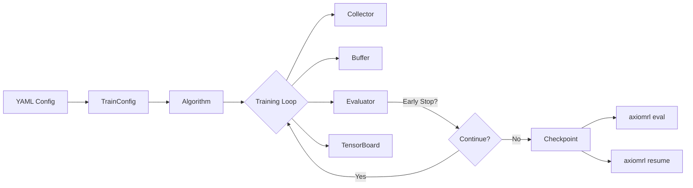
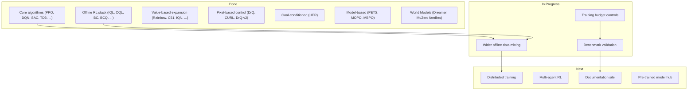

<p align="center">
  <a href="#installation"></a>
  <a href="#installation"></a>
  <a href="#installation"></a>
  
  
  
</p>

<p align="center">
  <b>A modular reinforcement learning library built for research and production.</b><br>
  80+ algorithms · Unified API · CLI-first workflow · Core / Contrib / Zoo architecture
</p>

---

## Highlights

AxiomRL is a PyTorch-based reinforcement learning library that provides a **unified interface** across 80+ algorithms — from classic DQN to offline RL, world models, and model-based planning. Designed to grow from research prototype to production-grade toolkit.

The project is organized as **core + contrib + zoo** so stable training code, experimental extensions, and benchmark presets stay cleanly separated.

| Feature | Description |
|---|---|
| **80+ algorithms** | On-policy, off-policy, offline, model-based, world models, goal-conditioned |
| **Unified API** | Every algorithm shares `TrainConfig → train / eval / resume` |
| **CLI-first** | `axiomrl train`, `axiomrl eval`, `axiomrl resume`, `axiomrl zoo` |
| **Modular layers** | Core (stable) → Contrib (experimental) → Zoo (presets & benchmarks) |
| **Full pipeline** | VecEnv, checkpointing, TensorBoard, early stopping, LR scheduling |
| **Offline RL stack** | NPZ, PT, Minari datasets with mixing, reward transforms, and `next_actions` |
| **Pixel observations** | Atari wrappers, generic pixel wrappers for continuous control |
| **Goal-conditioned** | HER with built-in sparse-reward environments |
| **YAML config** | Declarative experiment configuration with packaged presets |

## Stable Core API

AxiomRL now draws a hard line between the small semver-governed surface for application engineers and the broader research surface for advanced workflows.

- Import stable algorithms and `TrainConfig` from `rl_training.core` for day-to-day usage.
- Use `rl_training.experimental` for the wider algorithm catalog when you accept faster-moving APIs.
- Keep using `rl_training.contrib` for extensions that are intentionally outside the stable core contract.
- Legacy advanced imports from the package root remain available, but they are deprecated and warn so downstream users can migrate before removal.

The current stable core covers `A2C`, `BC`, `CQL`, `DQN`, `DiscreteSAC`, `IQL`, `PPO`, `SAC`, `TD3`, and `TRPO`.

```python
from rl_training.core import PPO, TrainConfig
from rl_training.experimental import DrQ
```

## Semantic Versioning

AxiomRL uses Semantic Versioning for the stable core API. Breaking changes to `rl_training.core`, the stable root exports, and the supported `TrainConfig` contract land only in major releases. Deprecations first ship with warnings and stay available for at least one minor release before removal.

The compatibility policy, supported dependency matrix, and deprecation rules are documented in [docs/compatibility.md](docs/compatibility.md).

## Quick Start

```python
from rl_training import PPO, TrainConfig

algo = PPO(TrainConfig(
    algo="ppo",
    env_id="CartPole-v1",
    seed=42,
    total_timesteps=100_000,
    output_dir="runs/ppo-cartpole",
))
result = algo.learn()
```

Or use the CLI:

```bash
# Sanity-check your environment (prints versions + CUDA availability)
axiomrl doctor

axiomrl train --config configs/ppo/cartpole.yaml
axiomrl eval  --checkpoint runs/<run-id>/checkpoints/step_<n>.pt
```

For benchmark-grade comparisons, run a multi-seed sweep from one config:

```bash
axiomrl train --config configs/ppo/cartpole.yaml --seeds 1,2,3
```

This launches standard per-seed training runs under the configured `output_dir`
and also writes one aggregate benchmark summary artifact at
`<output_dir>/benchmark-summary.json`. Use this sweep workflow before feeding
the resulting runs into `axiomrl zoo` report and leaderboard commands. If
`<output_dir>/benchmark-summary.json` already exists, the sweep fails instead
of overwriting it, so use a fresh `output_dir` or remove the old summary first.

For hyperparameter studies, point `axiomrl tune` at a study YAML that wraps an
existing train config:

```bash
axiomrl tune --config studies/ppo_cartpole_tune.yaml
axiomrl tune --resume-study runs/studies/ppo_cartpole_tune
axiomrl tune-report --study-dir runs/studies/ppo_cartpole_tune
axiomrl tune-report --study-dir runs/studies/ppo_cartpole_tune --report-output json --output reports/ppo_cartpole_tune.json
axiomrl tune-report --study-dir runs/studies/ppo_cartpole_tune --status completed --sort-by objective-value --descending --top-k 1
axiomrl tune-report --study-dir runs/studies/ppo_cartpole_tune --sort-by duration-seconds --descending
axiomrl tune-report --study-dir runs/studies/ppo_cartpole_tune --objective-at-least 200
axiomrl tune-report --study-dir runs/studies/ppo_cartpole_tune --duration-at-most 600
axiomrl tune-report --study-dir runs/studies/ppo_cartpole_tune --frontier-only
axiomrl tune-report --study-dir runs/studies/ppo_cartpole_tune --status completed --param total_timesteps=128 --param algo_kwargs.learning_rate=0.0003
axiomrl tune-report --study-dir runs/studies/ppo_cartpole_tune --error "RuntimeError: boom"
axiomrl tune-report --study-dir runs/studies/ppo_cartpole_tune --error-contains runtimeerror
axiomrl tune-report --study-dir runs/studies/ppo_cartpole_tune --error-type runtimeerror
axiomrl tune-report --study-dir runs/studies/ppo_cartpole_tune --focus-param total_timesteps
axiomrl tune-report --study-dir runs/studies/ppo_cartpole_tune --focus-param total_timesteps --focus-sort-by value
axiomrl tune-report --study-dir runs/studies/ppo_cartpole_tune --focus-param total_timesteps --focus-sort-by incumbent-updates
axiomrl tune-report --study-dir runs/studies/ppo_cartpole_tune --focus-param total_timesteps --focus-sort-by mean-duration-seconds
axiomrl tune-report --study-dir runs/studies/ppo_cartpole_tune --focus-param total_timesteps --focus-top-k 2
axiomrl tune-report --study-dir runs/studies/ppo_cartpole_tune --status completed --sort-by objective-value --descending --top-k 3 --export-configs-dir exports/ppo_cartpole_top3
```

`axiomrl tune` writes one study directory with `study.json`, `trials.jsonl`,
`best_trial.json`, `best_config.yaml`, and one nested `trials/` run tree that
reuses the standard training artifacts for each trial. If a study directory
already exists with a partial `trials.jsonl`, `axiomrl tune --resume-study ...`
reloads the stored study config and continues only the missing trial indices.
Use `axiomrl tune-report` when you want a read-only summary export in `text`,
`json`, or `csv` without resuming or modifying the study. Add `--status
completed|failed`, `--sort-by trial-index|objective-value|duration-seconds`,
`--descending`, and `--top-k <n>` when you want to isolate best trials,
inspect only failures, or rank slowest / fastest trials by wall-clock duration.
Add `--objective-at-least <value>` or `--objective-at-most <value>` when you
want to keep only visible trials whose raw objective metric falls inside a
specific numeric band.
Add `--duration-at-least <seconds>` or `--duration-at-most <seconds>` when you
want to keep only visible trials whose derived wall-clock duration falls inside
a specific numeric band.
Add `--frontier-only` when you want to keep only the current visible trials on
the objective-vs-duration Pareto frontier before any final sorting or `top-k`
truncation is applied.
Add repeated `--param key=value` filters when you want to inspect only the
visible trials that exactly match specific hyperparameter assignments.
Add `--error <text>` when you want an exact failed-trial error match, usually
by copying one entry from `selected_error_summaries`.
Add `--error-contains <text>` when you want a case-insensitive substring match
against failed trial error text so one failure family can be isolated quickly.
Add `--error-type <name>` when you want a case-insensitive exact match on the
derived exception class, for example `RuntimeError`.
Use only one of the message-level error filters at a time.
Add `--focus-param <name>` when you want one hyperparameter's value buckets
pulled into a dedicated mini-leaderboard ordered by bucket strength; text
reports show a focused section and CSV rows expose the matched bucket fields in
flattened `focused_parameter_*` columns.
Add `--focus-sort-by best-objective-value|mean-objective-value|completion-rate|incumbent-updates|mean-duration-seconds|value`
when you want that focused bucket view ordered by objective strength, success
rate, best-so-far update contribution, raw value, or fastest mean wall-clock
bucket duration.
Add `--focus-top-k <n>` when you only want the strongest `n` focused buckets
after that ordering is applied. Focus-only flags require `--focus-param`.
JSON reports also include `selected_status_counts`,
`selected_objective_summary`, `selected_parameter_summaries`,
`selected_parameter_incumbent_summaries`, and
`selected_parameter_value_summaries` for the currently visible trial slice.
They also include `selected_duration_summary` plus per-trial
`duration_seconds` so timing cost stays visible in both summaries and rows.
They also include `selected_incumbent_trace`, a visible-slice best-so-far
timeline ordered by `trial_index`, plus per-trial
`selected_incumbent_trial_index`, `selected_incumbent_objective_value`, and
`selected_is_incumbent_update` fields so convergence can be plotted or filtered
without reconstructing the incumbent path client-side.
They also include `selected_incumbent_update_summary`, which condenses how many
visible incumbent updates occurred, where the first/latest ones landed, how
large later improvements were versus the previous incumbent, and how many
visible trials elapsed between updates. Each visible trial row also exposes
`selected_incumbent_update_improvement` and
`selected_incumbent_trials_since_previous_update` so incumbent update quality
and spacing can be exported directly in JSON, text, and CSV outputs.
They also include `selected_incumbent_staleness_summary`, which reports how old
the current visible incumbent is at the tail of the slice and what the maximum
visible incumbent age became over the run. Each visible trial row also exposes
`selected_incumbent_age_trials` and `selected_incumbent_age_seconds` so best
plateau length can be inspected directly without rebuilding the timeline
client-side.
They also include `selected_objective_duration_frontier`, a Pareto frontier of
the visible completed timed trials over objective quality and wall-clock
duration, plus a per-trial `is_objective_duration_frontier` flag so JSON and
CSV consumers can identify the visible efficiency frontier directly.
Each `selected_parameter_value_summaries` bucket also includes
`timed_trials`, `untimed_trials`, `min_duration_seconds`,
`max_duration_seconds`, `mean_duration_seconds`, and
`median_duration_seconds` so hyperparameter values can be compared by runtime
cost as well as objective quality. They also include `incumbent_updates` plus
`latest_incumbent_trial_index` so you can see which hyperparameter values most
often produced visible best-so-far improvements, and how late those updates
arrived in the visible slice.
At the parameter level, `selected_parameter_incumbent_summaries` condenses
those bucket-level update counts into per-parameter rollups such as
`contributing_values`, `top_incumbent_value`, and `latest_incumbent_value`.
`selected_parameter_incumbent_leaderboard` then turns those per-parameter
rollups into an ordered ranking so the most incumbent-driving hyperparameters
are immediately visible without client-side sorting.
They also include `selected_parameter_effect_leaderboard`, which uses the
already-exposed parameter value buckets to rank hyperparameters by how wide
their observed best/mean objective spread is across visible values. That makes
it easy to spot which knobs appear to matter most in the current visible slice
without claiming a heavier model-based importance analysis.
They also include `selected_error_summaries` so failed trials are grouped by
error text with per-error counts, shares, and trial indices.
They also include `selected_error_type_summaries` so failed trials can be
grouped by exception class while still retaining the matched full error texts.
They also expose
`selected_best_trial_index`, `selected_best_objective_value`, and a
per-trial `selected_best_objective_delta` field so each visible trial shows its
gap from the current visible best. Parameter summaries now also include
observed unique counts plus search-space-aware `candidate_count` and
`coverage_ratio` fields when the study search space is discrete. Value
summaries group trials by each observed hyperparameter value and report
completed/failed counts, completion/failure rates, bucket-level rank fields,
and best/mean/median objective values for each bucket.
A top-level
`search_efficiency_summary` block condenses failure rate, best-vs-center deltas,
highest/lowest coverage parameters, and visible-slice convergence speed fields
such as `selected_trials_until_best`, `completed_trials_until_best`, and
`time_to_best_seconds`. Text and CSV outputs also flatten these convergence
metrics into `search_efficiency_*` fields for direct inspection. Add
`--export-configs-dir <dir>` when you want the current visible completed trials
exported as ranked YAML configs plus a `manifest.json`; JSON reports include the
resulting `config_export_summary`.

<details>
<summary><b>More CLI examples</b></summary>

```bash
# Classic control
axiomrl train --config configs/dqn/cartpole.yaml
axiomrl train --config configs/a2c/cartpole.yaml
axiomrl train --config configs/trpo/cartpole.yaml

# Continuous control
axiomrl train --config configs/sac/pendulum.yaml
axiomrl train --config configs/td3/pendulum.yaml
axiomrl train --config configs/crossq/pendulum.yaml

# Offline RL
axiomrl train --config configs/iql/pendulum.yaml
axiomrl train --config configs/cql/pendulum.yaml
axiomrl train --config configs/bc/pendulum.yaml

# Atari
axiomrl train --config configs/dqn/breakout_atari.yaml
axiomrl train --config configs/ppo/breakout_atari.yaml

# Pixel-based continuous control
axiomrl train --config configs/drq/pendulum_pixels.yaml
axiomrl train --config configs/curl/pendulum_pixels.yaml
axiomrl train --config configs/drqv2/pendulum_pixels.yaml

# Goal-conditioned
axiomrl train --config configs/her/point_goal.yaml

# Model-based
axiomrl train --config configs/pets/pendulum.yaml
axiomrl train --config configs/mopo/pendulum.yaml

# Zoo presets
axiomrl zoo --format commands
axiomrl report --runs-dir runs
axiomrl leaderboard --runs-dir runs --group-by preset --top-k 10
axiomrl zoo --format report --runs-dir runs
axiomrl zoo --format report --runs-dir runs --report-output json --algo dqn
axiomrl zoo --format report --runs-dir runs --report-output json --output reports/benchmark_report.json
axiomrl zoo --format report --runs-dir runs --group-by preset --sort-by best_eval_return_mean --descending --top-k 5
axiomrl zoo --format leaderboard --runs-dir runs --group-by preset --top-k 10
axiomrl zoo --format leaderboard --runs-dir runs --group-by preset --min-seeds 3
axiomrl zoo --format leaderboard --runs-dir runs --group-by preset --leaderboard-metric latest-normalized
axiomrl zoo --format leaderboard --runs-dir runs --group-by preset --compare-to latest
axiomrl zoo --format leaderboard --runs-dir runs --group-by preset --compare-to latest --score-view return
axiomrl zoo --format leaderboard --runs-dir runs --group-by preset --leaderboard-metric stability-normalized
axiomrl zoo --format leaderboard --runs-dir runs --group-by preset --leaderboard-metric confidence-normalized
axiomrl zoo --format leaderboard --runs-dir runs --group-by preset --leaderboard-metric median-normalized
axiomrl zoo --format leaderboard --runs-dir runs --group-by preset --leaderboard-metric iqr-normalized
axiomrl zoo --format leaderboard --runs-dir runs --group-by preset --baseline-preset dqn_breakout --leaderboard-metric delta-vs-baseline-normalized
axiomrl zoo --format leaderboard --runs-dir runs --group-by preset --report-output json --fail-on-manifest-drift
axiomrl zoo --format leaderboard --runs-dir runs --group-by preset --report-output json --fail-on-manifest-drift-severity error
axiomrl zoo --format leaderboard --runs-dir runs --group-by preset --report-output json --fail-on-manifest-drift-type unknown-preset
axiomrl train --config zoo/atari/dqn_breakout.yaml

# Resume training
axiomrl resume --checkpoint runs/<run-id>/checkpoints/step_<n>.pt

# Module form
python -m rl_training train --config configs/dqn/cartpole.yaml
```
</details>

<details>
<summary><b>Additional packaged presets and references</b></summary>

```bash
axiomrl train --config configs/ars/pendulum.yaml
axiomrl train --config configs/openai_es/pendulum.yaml
axiomrl train --config configs/crr/pendulum.yaml
axiomrl train --config configs/awr/pendulum.yaml
axiomrl train --config configs/marwil/pendulum.yaml
axiomrl train --config configs/cal_ql/pendulum.yaml
axiomrl train --config configs/edac/pendulum.yaml
axiomrl train --config configs/rlpd/pendulum.yaml
axiomrl train --config configs/xql/pendulum.yaml
axiomrl train --config configs/rebrac/pendulum.yaml
python -m rl_training.examples.dqn_breakout_atari_reference
```

Packaged config paths also include `configs/awac/pendulum.yaml`, `configs/bear/pendulum.yaml`,
`configs/bcq/pendulum.yaml`, `configs/cal_ql/pendulum.yaml`, `configs/crr/pendulum.yaml`,
`configs/awr/pendulum.yaml`, `configs/marwil/pendulum.yaml`, `configs/edac/pendulum.yaml`,
`configs/rlpd/pendulum.yaml`, `configs/xql/pendulum.yaml`, `configs/rebrac/pendulum.yaml`,
`configs/decision_transformer/pendulum.yaml`, `configs/impala/cartpole.yaml`,
`configs/appo/cartpole.yaml`, `configs/ppg/cartpole.yaml`, and
`configs/discrete_sac/cartpole.yaml`.
</details>

## Installation

**Core package:**

```bash
pip install axiomrl
```

**With Atari support:**

```bash
pip install "axiomrl[atari]"
```

**With offline dataset support (Minari):**

```bash
pip install "axiomrl[offline]"
```

**With tuning support (Optuna backend):**

```bash
pip install "axiomrl[tuning]"
```

**With the experimental namespace enabled:**

```bash
pip install "axiomrl[experimental]"
```

**With development tooling from a local checkout:**

```bash
pip install -e ".[dev]"
```

`.[dev]` includes optional dependencies used by pixel-observation wrappers and
render-based test coverage (for example `opencv-python` and `pygame`).

> **Requirements:** Python 3.10+ · PyTorch · Gymnasium · NumPy · PyYAML · TensorBoard

## Architecture

AxiomRL uses a deliberate three-layer architecture that lets the project scale without becoming a collection of disconnected scripts:

| Layer | Purpose | Examples |
|-------|---------|----------|
| **Core** | Stable train / eval / resume for mainstream algorithms | PPO, DQN, SAC, TD3, IQL, CQL, BC... |
| **Contrib** | Experimental extensions with additional complexity | RecurrentPPO (LSTM), GAIL |
| **Zoo** | Named presets, benchmark manifests, launch recipes | Atari DQN/PPO presets, benchmark YAML |

```python
# Core: stable algorithms
from rl_training import PPO, DQN, SAC, IQL, HER, TrainConfig

# Contrib: experimental extensions
from rl_training.contrib import RecurrentPPO
```

## Algorithms

AxiomRL implements **80+ algorithms** across six major categories:

### Full Algorithm Table

<details>
<summary><b>On-Policy</b></summary>

| Algorithm | Type | Action Space |
|-----------|------|--------------|
| PPO | Policy gradient | Box, Discrete |
| A2C | Policy gradient | Box, Discrete |
| TRPO | Policy gradient | Box, Discrete |
| PPG | Policy gradient | Discrete |
| GAIL | Imitation + PG | Box, Discrete |
| IMPALA | Distributed AC | Discrete |
| APPO | Distributed AC | Discrete |
| RecurrentPPO | Recurrent PG (contrib) | Box, Discrete |
| ARS | Evolutionary | Box |
| OpenAI ES | Evolutionary | Box |

</details>

<details>
<summary><b>Off-Policy (Continuous)</b></summary>

| Algorithm | Type | Action Space |
|-----------|------|--------------|
| SAC | Actor-Critic | Box |
| TD3 | Actor-Critic | Box |
| DDPG | Actor-Critic | Box |
| CrossQ | Low-tuning AC | Box |
| REDQ | Ensemble AC | Box |
| TQC | Quantile AC | Box |
| D4PG | Distributed AC | Box |
| NAF | Q-learning | Box |
| Discrete SAC | Actor-Critic | Discrete |
| DrQ | Pixel-based (SAC) | Box |
| CURL | Pixel-based (contrastive) | Box |
| DrQ-v2 | Pixel-based (TD3) | Box |

</details>

<details>
<summary><b>Value-Based (Discrete)</b></summary>

| Algorithm | Type | Notes |
|-----------|------|-------|
| DQN | Value-based | Classic |
| Double DQN | Value-based | Reduced overestimation |
| Dueling DQN | Value-based | Advantage decomposition |
| Noisy DQN | Exploration | Noisy networks |
| Prioritized DQN | Sampling | Prioritized replay |
| N-Step DQN | Multi-step | N-step returns |
| C51 (Categorical DQN) | Distributional | Categorical distribution |
| QR-DQN | Distributional | Quantile regression |
| IQN | Distributional | Implicit quantiles |
| FQF | Distributional | Fully quantile function |
| Rainbow DQN | Combined | Multi-enhancement combo |
| Expected SARSA | On-policy value | Expected value |
| Boltzmann DQN/Double | Exploration | Softmax policy |
| Mellowmax DQN | Exploration | Mellowmax operator |
| Soft DQN/Double | Exploration | Soft Q-learning |
| Munchausen DQN/Double | Regularization | Self-regularized |
| CQL-DQN/Double | Conservative | Conservative penalty |
| Hysteretic DQN | Multi-agent | Asymmetric learning rates |
| Clipped Double DQN | Regularization | Min of two Q-networks |
| Advantage Learning DQN | Advantage | AL operator |
| Persistent AL DQN | Advantage | Persistent AL |
| DRQN | Recurrent | LSTM Q-network |
| R2D2 | Recurrent | Replay with recurrence |
| Agent57 | Recurrent | Adaptive exploration |
| SPR | Self-predictive | Representation learning |

</details>

<details>
<summary><b>Offline RL</b></summary>

| Algorithm | Type | Notes |
|-----------|------|-------|
| BC | Imitation | Behavioral cloning |
| AWR | Weighted | Advantage-weighted regression |
| AWAC | Weighted AC | Advantage-weighted AC |
| MARWIL | Weighted | RLlib-style weighted imitation |
| BCQ | Constrained | Batch-constrained Q-learning |
| BEAR | Constrained | Support-matching AC |
| CRR | Constrained | Critic-regularized regression |
| TD3+BC | Constrained | TD3 with BC penalty |
| ReBRAC | Constrained | Behavior-regularized AC |
| IQL | Value-based | In-sample Q-learning |
| CQL | Conservative | Conservative Q-learning |
| Cal-QL | Conservative | Calibrated CQL |
| XQL | Value-based | Extreme value regression |
| EDAC | Ensemble | Ensemble-diversified AC |
| RLPD | Online-to-offline | Prior data with SAC |

</details>

<details>
<summary><b>Model-Based & World Models</b></summary>

| Algorithm | Type | Notes |
|-----------|------|-------|
| PETS | MPC | Ensemble dynamics + CEM |
| MOPO | Model-based offline | Pessimistic reward |
| MBPO | Model-based online | Dyna-style rollouts |
| Decision Transformer | Sequence model | Offline sequence decision |
| Dreamer | World model | Latent imagination |
| DreamerV3 | World model | Symlog + discrete latent |
| Diamond | World model | Diffusion world model |
| MuZero | Planning | Learned model tree search |
| Gumbel MuZero | Planning | Policy improvement with Gumbel |
| EfficientZero | Planning | Sample-efficient MuZero |
| ScaleZero | Planning | Scalable MuZero |

</details>

<details>
<summary><b>Goal-Conditioned & Special</b></summary>

| Algorithm | Type | Notes |
|-----------|------|-------|
| HER | Goal-conditioned | Hindsight experience replay |
| PODreamer | World model | Partially observable Dreamer |
| EADream | World model | Energy-aware Dreamer |
| MoW | World model | Mixture of World models |
| JOWA | World model | Joint World-Action model |
| HorizonImagination | World model | Horizon-aware imagination |

</details>

## Training Workflow



Training runs write a run directory containing `metadata.json`, checkpoints, and
TensorBoard logs. See [docs/run-artifacts.md](docs/run-artifacts.md) for the
artifact layout and the `metadata.json` schema.

## Configuration

AxiomRL uses YAML files for experiment configuration. Every training parameter is declarative and reproducible:

See [docs/config-schema.md](docs/config-schema.md) for the core `TrainConfig` key schema and linked preset rules.

Use `axiomrl config --config <path>` to print the resolved `TrainConfig` payload (JSON by default) before running.

```yaml
algo: ppo
env_id: CartPole-v1
seed: 42
total_timesteps: 100000
output_dir: runs/ppo-cartpole
eval_episodes: 10
algo_kwargs:
  learning_rate: 0.0003
  n_steps: 2048
  batch_size: 64
  n_epochs: 10
  gamma: 0.99
  gae_lambda: 0.95
  clip_range: 0.2
  ent_coef: 0.01
```

### Early Stopping & LR Scheduling

```yaml
algo_kwargs:
  eval_interval: 1000
  early_stopping:
    metric: eval_return_mean
    mode: max
    patience: 5
    min_delta: 1.0
    min_steps: 5000
  learning_rate_schedule:
    type: cosine    # constant | linear | cosine
    start: 1.0
    end: 0.1
```

### Discrete Exploration Scheduling

```yaml
algo_kwargs:
  epsilon_schedule:
    type: cosine    # constant | linear | cosine
    start: 1.0
    end: 0.01
  epsilon_warmup_steps: 10000
```

`epsilon_schedule` is supported by epsilon-greedy discrete trainers such as `dqn`,
`double_dqn`, `dueling_dqn`, `rainbow_dqn`, `fqf`, `iqn`, `spr`, `jowa`,
`drqn`, `r2d2`, and `agent57`. If omitted, the legacy
`epsilon_start / epsilon_end / exploration_fraction` path still works.

### Entropy Coefficient Scheduling

```yaml
# PPO-style trainers
algo_kwargs:
  ent_coef_schedule:
    type: linear    # constant | linear | cosine
    start: 0.02
    end: 0.001
  ent_coef_warmup_steps: 5000

# Dreamer-style trainers
algo_kwargs:
  entropy_coef_schedule:
    type: cosine
    start: 0.003
    end: 0.0001
  entropy_coef_warmup_steps: 10000
```

Entropy scheduling is supported by PPO-style policy-gradient trainers such as
`ppo`, `a2c`, `impala`, `ppg`, `appo`, `recurrent_ppo`, `trpo`, and `gail`, plus
Dreamer-family trainers such as `dreamer`, `dreamerv3`, `diamond`,
`horizon_imagination`, `po_dreamer`, `twisted`, `eadream`, and `mow`.
If omitted, the legacy fixed `ent_coef` / `entropy_coef` values still work.

### Policy Clip Scheduling

```yaml
algo_kwargs:
  clip_coef_schedule:
    type: linear    # constant | linear | cosine
    start: 0.3
    end: 0.05
  clip_coef_warmup_steps: 5000
```

`clip_coef_schedule` is supported by clipped-policy trainers such as `ppo`,
`appo`, `ppg`, `recurrent_ppo`, and `gail`. Fixed `clip_coef` still works, and
`clip_range` is accepted as a compatibility alias for the fixed value, schedule,
and warmup keys.

### Search Temperature Scheduling

```yaml
algo_kwargs:
  temperature_schedule:
    type: linear    # constant | linear | cosine
    start: 1.5
    end: 0.1
  temperature_warmup_steps: 10000
```

`temperature_schedule` is supported by MuZero-family trainers such as
`muzero`, `gumbel_muzero`, `efficientzero`, and `scalezero`. Fixed
`temperature` still works if no schedule is configured.

### Root Noise Scheduling

```yaml
algo_kwargs:
  root_exploration_fraction_schedule:
    type: linear    # constant | linear | cosine
    start: 0.5
    end: 0.05
  root_exploration_fraction_warmup_steps: 10000
```

`root_exploration_fraction_schedule` is supported by MuZero-family trainers such
as `muzero`, `gumbel_muzero`, `efficientzero`, and `scalezero`. Fixed
`root_exploration_fraction` still works if no schedule is configured.

### Search Simulation Scheduling

```yaml
algo_kwargs:
  num_simulations_schedule:
    type: linear    # constant | linear | cosine
    start: 25
    end: 5
  num_simulations_warmup_steps: 10000
```

`num_simulations_schedule` is supported by MuZero-family trainers such as
`muzero`, `gumbel_muzero`, `efficientzero`, and `scalezero`. Fixed
`num_simulations` still works if no schedule is configured.

### Offline Dataset Configuration

```yaml
# Single dataset
algo_kwargs:
  dataset_kind: npz          # random | npz | pt | minari
  dataset_path: data/pendulum_medium.npz

# Mixed datasets
algo_kwargs:
  dataset_mix:
    - kind: npz
      dataset_path: data/pendulum_medium.npz
      weight: 0.7
    - kind: pt
      dataset_path: data/pendulum_expert.pt
      weight: 0.3
  dataset_mix_size: 200000

# Minari datasets
algo_kwargs:
  dataset_kind: minari
  dataset_id: hopper-medium-v0
  dataset_download: true
```

### Reward Wrappers

```yaml
# Manual transforms
env_kwargs:
  wrappers:
    reward:
      scale: 0.1
      shift: 0.0
      clip: [-1.0, 1.0]

# `strategy` is an alias for `preset`
# Named presets:
#   sign_clip | atari_clip | clip_1 | sparse_goal_zero_one
#   survival_penalty | goal_success_bonus
env_kwargs:
  wrappers:
    reward:
      strategy: sign_clip

# Outcome shaping for sparse/goal tasks
env_kwargs:
  wrappers:
    reward:
      step_penalty: -0.01
      success_bonus: 1.0
      failure_penalty: -1.0
      success_keys: [is_success, success, goal_achieved]

# Atari / ALE recipe
# If `wrappers.reward` is active, Atari default `clip_reward`
# is disabled unless you explicitly set `wrappers.atari.clip_reward: true`.
env_kwargs:
  wrappers:
    reward:
      strategy: atari_clip

# Survival / time-cost recipe
env_kwargs:
  wrappers:
    reward:
      strategy: survival_penalty
```

`reward` wrappers now support both scalar transforms and episode-outcome shaping. Use `step_penalty` for per-step costs, `terminal_bonus` for end-of-episode adjustments, and `success_bonus` / `failure_penalty` when the environment exposes a success flag in `info` such as `is_success` or `success`. For Atari-style training, set `reward.strategy: atari_clip`; the env factory disables default Atari reward clipping when a non-identity generic reward strategy is configured, unless `wrappers.atari.clip_reward` is explicitly set.

### Mode-Specific Env Overrides

```yaml
env_kwargs:
  frameskip: 1
  repeat_action_probability: 0.0
  full_action_space: false
  wrappers:
    atari:
      screen_size: 84
      frame_skip: 4
      noop_max: 30
      grayscale_obs: true
      frame_stack: 4
      clip_reward: true
      channel_first: true

  # Applied only when build_env(..., evaluation=False)
  training:
    repeat_action_probability: 0.0

  # Applied only when build_env(..., evaluation=True)
  evaluation:
    repeat_action_probability: 0.25
    wrappers:
      atari:
        clip_reward: false
```

Use `env_kwargs.training` and `env_kwargs.evaluation` to keep one scenario definition while changing train-time versus eval-time protocol. Nested mappings are merged recursively, so evaluation overrides can change only `wrappers.atari.clip_reward` without repeating the full Atari wrapper block.

### Evaluation Video Capture

```yaml
env_kwargs:
  evaluation:
    render_mode: rgb_array
    wrappers:
      video:
        episode_trigger_every: 1
        video_length: 1000
        name_prefix: breakout-eval
```

`wrappers.video` applies `gym.wrappers.RecordVideo`. If `video_folder` is omitted, videos are written to `output_dir/videos/evaluation` for evaluation envs and `output_dir/videos/training` for training envs. Put the config under `env_kwargs.evaluation` when you want evaluation-only capture.

### Benchmark Metadata

```yaml
benchmark:
  best_metric: eval_return_mean
  best_metric_mode: max
  score_normalization:
    type: human_random
    source: atari_breakout_reference
```

`benchmark.score_normalization` accepts explicit `random_score` / `human_score` values or a named `source` such as `atari_breakout_reference`. When configured, evaluation metrics include `eval_human_normalized_score`. Training runs also maintain `checkpoints/best.pt` using `benchmark.best_metric` / `benchmark.best_metric_mode`, and `metadata.json` is updated with the best checkpoint source step and metric value. Zoo report and leaderboard JSON exports also carry compact `manifest_metadata` identity info, `manifest_source` path-resolution info, `manifest_alignment_summary` drift counts plus severity and named drifted presets, gate-aware `manifest_alignment_fail_reasons`, manifest-derived `protocol_metadata`, resolved `score_normalization_metadata`, and per-row `preset_metadata` so downstream analysis can keep protocol context attached to each preset aggregate.

Zoo presets can inherit these defaults automatically from their suite manifest. For example, `axiomrl train --config zoo/atari/dqn_breakout.yaml` now picks up:

- benchmark metadata such as `suite`, `preset_name`, `protocol_name`, and score-normalization defaults
- protocol-specific env overrides under `env_kwargs.training` / `env_kwargs.evaluation`
- sticky-action evaluation defaults from the Atari benchmark manifest

### Pixel Observations

```yaml
algo: drq
env_id: Pendulum-v1
env_kwargs:
  render_mode: rgb_array
  wrappers:
    pixels:
      resize_shape: [84, 84]
      frame_stack: 3
      channel_first: true
algo_kwargs:
  features_dim: 256
  augmentation_pad: 4
```

## Programmatic Usage

### Basic Training

```python
from rl_training import PPO, TrainConfig

algo = PPO(TrainConfig(
    algo="ppo",
    env_id="CartPole-v1",
    seed=42,
    total_timesteps=100_000,
))
result = algo.learn()
```

### Offline RL

```python
from rl_training import IQL, TrainConfig
from rl_training.data import export_random_transition_dataset

dataset_path = export_random_transition_dataset(
    "Pendulum-v1",
    "data/pendulum_rollout.npz",
    num_steps=5_000,
    seed=7,
)

algo = IQL(TrainConfig(
    algo="iql",
    env_id="Pendulum-v1",
    seed=7,
    total_timesteps=20_000,
    algo_kwargs={
        "dataset_kind": "npz",
        "dataset_path": "data/pendulum_medium.npz",
        "batch_size": 256,
        "hidden_sizes": [256, 256],
    },
))
result = algo.learn()
```

### Goal-Conditioned

```python
from rl_training import HER, TrainConfig

algo = HER(TrainConfig(
    algo="her",
    env_id="RL-PointGoal1D-v0",
    seed=7,
    total_timesteps=20_000,
    algo_kwargs={
        "buffer_capacity": 50_000,
        "her_ratio": 0.8,
        "goal_selection_strategy": "future",
    },
))
result = algo.learn()
```

### Contrib (Experimental)

```python
from rl_training.contrib import RecurrentPPO
from rl_training import TrainConfig

algo = RecurrentPPO(TrainConfig(
    algo="recurrent_ppo",
    env_id="BreakoutNoFrameskip-v4",
    seed=42,
    total_timesteps=1_000_000,
))
result = algo.learn()
```

## Project Structure

```
axiomrl/
├── configs/                    # Algorithm config YAML files
│   ├── ppo/                    #   PPO presets (cartpole, atari, ...)
│   ├── dqn/                    #   DQN presets
│   ├── sac/                    #   SAC presets
│   └── ...                     #   80+ algorithm directories
├── docs/
│   ├── assets/                 # SVG diagrams and images
│   ├── plans/                  # Design documents
│   └── research/               # Research notes
├── examples/                   # Reference training scripts
├── scripts/                    # Utility scripts
│   ├── train.py
│   └── benchmark_zoo.py
├── src/rl_training/            # Main package
│   ├── algorithms/             #   Algorithm implementations (70+ files)
│   ├── api/                    #   Public API wrappers
│   ├── contrib/                #   Experimental extensions
│   ├── data/                   #   Buffers, datasets, samplers
│   ├── envs/                   #   Env factory, wrappers
│   ├── experiment/             #   Config, checkpointing, logging
│   ├── models/                 #   MLP, CNN, LSTM networks
│   ├── policies/               #   Policy abstractions
│   └── runtime/                #   Trainer, evaluator, collector
├── tests/                      # Test suite (100+ tests)
├── zoo/                        # Benchmark presets
│   └── atari/
└── pyproject.toml
```

## Zoo: Presets & Benchmarks

The Zoo layer provides curated presets and benchmark recipes on top of the core runtime:

```bash
# List all available zoo commands
axiomrl zoo --format commands
axiomrl report --runs-dir runs
axiomrl leaderboard --runs-dir runs --group-by preset --top-k 10
axiomrl zoo --format report --runs-dir runs
axiomrl zoo --format report --runs-dir runs --report-output json --algo dqn
axiomrl zoo --format report --runs-dir runs --report-output csv --env-id ALE/Breakout-v5 --sort-by best_eval_return_mean --descending
axiomrl zoo --format report --runs-dir runs --report-output json --output reports/benchmark_report.json
axiomrl zoo --format report --runs-dir runs --report-output csv --output reports/benchmark_report.csv
axiomrl zoo --format report --runs-dir runs --group-by preset --sort-by best_eval_return_mean --descending --top-k 5
axiomrl zoo --format leaderboard --runs-dir runs --group-by preset --top-k 10
axiomrl zoo --format leaderboard --runs-dir runs --group-by preset --min-seeds 3
axiomrl zoo --format leaderboard --runs-dir runs --group-by preset --leaderboard-metric latest-normalized
axiomrl zoo --format leaderboard --runs-dir runs --group-by preset --leaderboard-metric gap-return
axiomrl zoo --format leaderboard --runs-dir runs --group-by preset --compare-to latest
axiomrl zoo --format leaderboard --runs-dir runs --group-by preset --compare-to latest --score-view return
axiomrl zoo --format leaderboard --runs-dir runs --group-by preset --leaderboard-metric stability-normalized
axiomrl zoo --format leaderboard --runs-dir runs --group-by preset --leaderboard-metric confidence-normalized
axiomrl zoo --format leaderboard --runs-dir runs --group-by preset --leaderboard-metric median-normalized
axiomrl zoo --format leaderboard --runs-dir runs --group-by preset --leaderboard-metric iqr-normalized
axiomrl zoo --format leaderboard --runs-dir runs --group-by preset --baseline-preset dqn_breakout --leaderboard-metric delta-vs-baseline-normalized
axiomrl zoo --format leaderboard --runs-dir runs --group-by preset --report-output json --fail-on-manifest-drift
axiomrl zoo --format leaderboard --runs-dir runs --group-by preset --report-output json --fail-on-manifest-drift-severity error
axiomrl zoo --format leaderboard --runs-dir runs --group-by preset --report-output json --fail-on-manifest-drift-type unknown-preset

# Run a zoo preset
axiomrl train --config zoo/atari/dqn_breakout.yaml
axiomrl train --config zoo/atari/ppo_breakout.yaml
```

`axiomrl zoo --format report` prints both per-run lines and aggregate summaries grouped by `(algo, env_id)` by default. Run rows now include `best_minus_latest_*` delta fields. Aggregate rows add explicit `seed_count`, latest-vs-best gap metrics, `best_over_latest_*` ratios, rank columns for best/latest return and normalized score, cross-seed stability summaries such as latest `min/max/std`, confidence summaries such as `stderr` plus `ci95` half-width, robustness summaries such as `median` plus `iqr`, optional manifest-derived `preset_metadata`, per-run manifest drift flags (`manifest_preset_known`, `manifest_protocol_matches_manifest`, `manifest_alignment_status`, `manifest_alignment_severity`), per-aggregate drift counters plus severity, and optional baseline-relative delta/ratio fields so plateau detection, consistency checks, uncertainty-aware ranking, outlier-resistant comparisons, benchmark-protocol traceability, and baseline uplift tracking stay visible in the exported data. When `--baseline-preset` is active, machine-readable outputs also include a `baseline_summary` section with top movers and regressions by return and normalized-score delta, computed from the full filtered preset aggregate set even if `--top-k` truncates visible leaderboard entries. `--group-by preset` switches aggregates to benchmark preset level, `--min-seeds` drops under-seeded aggregate groups while keeping raw run rows in report output, `--top-k` truncates sorted outputs, and `--format leaderboard` renders only ranked aggregate entries. On benchmarks with score normalization configured, leaderboard default sorting now prefers `best_eval_human_normalized_score`; otherwise it falls back to `best_eval_return_mean`. Use `--compare-to latest|best` as the higher-level “final vs peak” switch, `--score-view return|normalized` as the return-vs-normalized axis switch, `--baseline-preset <preset>` when you want delta/ratio comparisons against a named preset while using `--group-by preset`, or `--leaderboard-metric` when you want a more specific alias instead of raw `--sort-by` fields; supported metric modes include `best-return`, `latest-return`, `gap-return`, `stability-return`, `confidence-return`, `median-return`, `iqr-return`, `delta-vs-baseline-return`, `ratio-vs-baseline-return`, `best-normalized`, `latest-normalized`, `gap-normalized`, `stability-normalized`, `confidence-normalized`, `median-normalized`, `iqr-normalized`, `delta-vs-baseline-normalized`, and `ratio-vs-baseline-normalized`. Stability modes rank lower cross-seed standard deviation higher, confidence modes rank lower 95% CI half-width higher, median modes rank higher robust central tendency higher, IQR modes rank lower cross-seed spread higher, and baseline modes rank larger uplift over the named baseline higher. `--baseline-preset` requires `--group-by preset`. `--score-view normalized` requires score normalization in the benchmark manifest. `--report-output json` and `--report-output csv` expose the same data for downstream analysis, including top-level `manifest_source` (`requested_path`, `resolved_path`, `source_kind`), top-level `manifest_metadata` (`fingerprint`, preset inventory), top-level `manifest_alignment_summary` (`total_runs`, `aligned_runs`, `drifted_runs`, mismatch counters, severity, named drifted presets), top-level `manifest_alignment_fail_reasons` (derived from the active fail-gate flags), top-level `protocol_metadata`, resolved `score_normalization_metadata`, and per-row `preset_metadata`/`preset_config`/`preset_description`; `--output` writes the rendered artifact to disk, `--fail-on-manifest-drift` fails on any `warning` or `error` drift, `--fail-on-manifest-drift-severity error` only fails on `error` drift, `--fail-on-manifest-drift-type unknown-preset|protocol-mismatch` fails on selected drift categories and may be repeated, and `--algo`, `--env-id`, `--sort-by`, and `--descending` let you narrow and rank benchmark slices directly in the CLI.

## Design Influences

AxiomRL's architecture draws from the best ideas in the RL ecosystem:

| Library | Influence |
|---------|-----------|
| [Stable-Baselines3](https://github.com/DLR-RM/stable-baselines3) | Stable algorithm core, common API, SB3-Contrib split |
| [RL Baselines3 Zoo](https://github.com/DLR-RM/rl-baselines3-zoo) | Zoo layer, training framework, preset-based experiments |
| [CleanRL](https://github.com/vwxyzjn/cleanrl) | Readable single-file references, reproducibility focus |
| [Tianshou](https://github.com/thu-ml/tianshou) | Modular runtime boundaries, collector/trainer/buffer design |

## Roadmap



## Contributing

Contributions are welcome! The codebase follows a layered approach:

1. **Core changes** go into `src/rl_training/algorithms/` and must not break existing `train / eval / resume` workflows
2. **Experimental algorithms** belong in `src/rl_training/contrib/`
3. **Presets and recipes** go into `zoo/` or `configs/`

```bash
# Install development dependencies (includes pixel/render test deps)
pip install -e ".[dev]"

# Install local git hooks
pre-commit install

# Run layered quality checks
make lint
make typecheck
make test-fast
make test-integration
make test-smoke
make build
```

See [CONTRIBUTING.md](CONTRIBUTING.md) for the contribution checklist and
[docs/development.md](docs/development.md) for the dependency matrix, marker
strategy, and verification commands.

## License

MIT

---

<p align="center">
  <sub>Built with PyTorch · Gymnasium · TensorBoard</sub>
</p>
