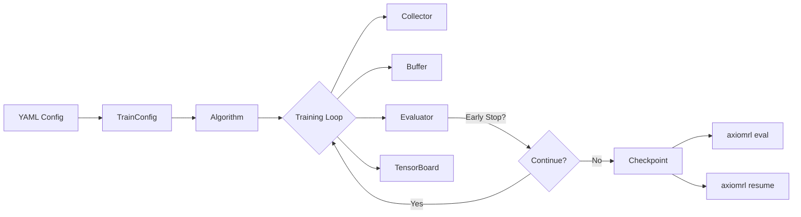

<h1 align="center">AxiomRL</h1>

<p align="center">
  <strong>A modular reinforcement learning library built for research and production.</strong><br>
  80+ algorithms · Unified API · CLI-first workflow · Core / Contrib / Zoo architecture
</p>

<p align="center">
  <a href="https://pypi.org/project/axiomrl/"></a>
  <a href="https://pypi.org/project/axiomrl/"></a>
  <a href="https://pypi.org/project/axiomrl/"></a>
  <a href="https://github.com/skygazer42/axiomrl/actions"></a>
  <a href="https://codecov.io/gh/skygazer42/axiomrl"></a>
  <a href="https://github.com/skygazer42/axiomrl/blob/main/LICENSE"></a>
  <a href="https://github.com/skygazer42/axiomrl"></a>
</p>

<p align="center">
  <a href="#quick-start">Quick Start</a> ·
  <a href="#installation">Installation</a> ·
  <a href="https://github.com/skygazer42/axiomrl#readme">Documentation</a> ·
  <a href="#algorithms">Algorithms</a> ·
  <a href="https://github.com/skygazer42/axiomrl/issues">Issues</a> ·
  <a href="CONTRIBUTING.md">Contributing</a>
</p>

---

## Highlights

AxiomRL is a PyTorch-based reinforcement learning library that provides a **unified interface** across 80+ algorithms — from classic DQN to offline RL, world models, and model-based planning.

| Feature | Description |
|---|---|
| **80+ Algorithms** | On-policy, off-policy, offline, model-based, world models, goal-conditioned |
| **Unified API** | Every algorithm shares `TrainConfig → train / eval / resume` |
| **CLI-first** | `axiomrl train`, `axiomrl eval`, `axiomrl resume`, `axiomrl zoo` |
| **Modular Layers** | Core (stable) → Contrib (experimental) → Zoo (presets & benchmarks) |
| **Reproducible** | Deterministic seeding, checkpoint resume, multi-seed sweeps |
| **Extensible** | YAML configs, reward wrappers, LR/entropy/epsilon scheduling |

## Quick Start

**Python API:**

```python
from rl_training import PPO, TrainConfig

algo = PPO(TrainConfig(
    algo="ppo",
    env_id="CartPole-v1",
    seed=42,
    total_timesteps=100_000,
    output_dir="runs/ppo-cartpole",
))
result = algo.learn()
```

**CLI:**

```bash
axiomrl doctor                                          # check environment
axiomrl train --config configs/ppo/cartpole.yaml        # train
axiomrl eval  --checkpoint runs/<run>/checkpoints/best.pt  # evaluate
axiomrl resume --checkpoint runs/<run>/checkpoints/step_<n>.pt  # resume
```

**Multi-seed sweep:**

```bash
axiomrl train --config configs/ppo/cartpole.yaml --seeds 1,2,3
```

## Installation

```bash
pip install axiomrl
```

Optional extras:

```bash
pip install "axiomrl[atari]"         # Atari/ALE support
pip install "axiomrl[offline]"       # Minari offline datasets
pip install "axiomrl[tuning]"        # Optuna hyperparameter tuning
pip install "axiomrl[experimental]"  # Experimental namespace
pip install -e ".[dev]"              # Development (from source)
```

> **Requirements:** Python 3.10+ · PyTorch 2.0+ · Gymnasium · NumPy · PyYAML · TensorBoard

## Stable Core API

AxiomRL keeps a small semver-governed surface for application engineers while still exposing a broader research playground.

- Import stable algorithms and `TrainConfig` from `rl_training.core` for production-facing workflows.
- Use `rl_training.experimental` when you want access to faster-moving research APIs.
- Keep using `rl_training.contrib` for extensions that sit outside the stable core contract.
- Legacy root-level advanced imports remain available for now, but they are **deprecated** so downstream users can migrate before removal.

```python
from rl_training.core import PPO, TrainConfig
from rl_training.experimental import DrQ
```

## Architecture

AxiomRL uses a three-layer architecture:

| Layer | Purpose | Examples |
|-------|---------|----------|
| **Core** | Stable train / eval / resume for mainstream algorithms | PPO, DQN, SAC, TD3, IQL, CQL, BC |
| **Contrib** | Experimental extensions with additional dependencies | RecurrentPPO (LSTM), GAIL |
| **Zoo** | Named presets, benchmark manifests, launch recipes | Atari DQN/PPO presets |

```python
from rl_training import PPO, DQN, SAC, IQL, HER, TrainConfig   # Core
from rl_training.contrib import RecurrentPPO                     # Contrib
```

## Algorithms

AxiomRL implements **80+ algorithms** across six categories:

<details>
<summary><b>On-Policy</b> — PPO, A2C, TRPO, PPG, GAIL, IMPALA, APPO, RecurrentPPO, ARS, OpenAI ES</summary>

| Algorithm | Type | Action Space |
|-----------|------|--------------|
| PPO | Policy gradient | Box, Discrete |
| A2C | Policy gradient | Box, Discrete |
| TRPO | Policy gradient | Box, Discrete |
| PPG | Policy gradient | Discrete |
| GAIL | Imitation + PG | Box, Discrete |
| IMPALA | Distributed AC | Discrete |
| APPO | Distributed AC | Discrete |
| RecurrentPPO | Recurrent PG (contrib) | Box, Discrete |
| ARS | Evolutionary | Box |
| OpenAI ES | Evolutionary | Box |

</details>

<details>
<summary><b>Off-Policy (Continuous)</b> — SAC, TD3, DDPG, CrossQ, REDQ, TQC, D4PG, NAF, DrQ, CURL, DrQ-v2</summary>

| Algorithm | Type | Action Space |
|-----------|------|--------------|
| SAC | Actor-Critic | Box |
| TD3 | Actor-Critic | Box |
| DDPG | Actor-Critic | Box |
| CrossQ | Low-tuning AC | Box |
| REDQ | Ensemble AC | Box |
| TQC | Quantile AC | Box |
| D4PG | Distributed AC | Box |
| NAF | Q-learning | Box |
| Discrete SAC | Actor-Critic | Discrete |
| DrQ | Pixel-based (SAC) | Box |
| CURL | Pixel-based (contrastive) | Box |
| DrQ-v2 | Pixel-based (TD3) | Box |

</details>

<details>
<summary><b>Value-Based (Discrete)</b> — DQN, Double/Dueling/Noisy/Prioritized/N-Step, C51, QR-DQN, IQN, FQF, Rainbow, R2D2, Agent57, SPR, ...</summary>

| Algorithm | Type | Notes |
|-----------|------|-------|
| DQN | Value-based | Classic |
| Double DQN | Value-based | Reduced overestimation |
| Dueling DQN | Value-based | Advantage decomposition |
| Noisy DQN | Exploration | Noisy networks |
| Prioritized DQN | Sampling | Prioritized replay |
| N-Step DQN | Multi-step | N-step returns |
| C51 | Distributional | Categorical distribution |
| QR-DQN | Distributional | Quantile regression |
| IQN | Distributional | Implicit quantiles |
| FQF | Distributional | Fully quantile function |
| Rainbow DQN | Combined | Multi-enhancement combo |
| DRQN | Recurrent | LSTM Q-network |
| R2D2 | Recurrent | Replay with recurrence |
| Agent57 | Recurrent | Adaptive exploration |
| SPR | Self-predictive | Representation learning |
| *and more...* | | Boltzmann, Mellowmax, Munchausen, CQL-DQN, Hysteretic, etc. |

</details>

<details>
<summary><b>Offline RL</b> — BC, IQL, CQL, BCQ, BEAR, TD3+BC, AWR, AWAC, CRR, Cal-QL, EDAC, RLPD, XQL, ReBRAC, MARWIL</summary>

| Algorithm | Type | Notes |
|-----------|------|-------|
| BC | Imitation | Behavioral cloning |
| IQL | Value-based | In-sample Q-learning |
| CQL | Conservative | Conservative Q-learning |
| Cal-QL | Conservative | Calibrated CQL |
| BCQ | Constrained | Batch-constrained Q-learning |
| BEAR | Constrained | Support-matching AC |
| TD3+BC | Constrained | TD3 with BC penalty |
| CRR | Constrained | Critic-regularized regression |
| ReBRAC | Constrained | Behavior-regularized AC |
| AWR | Weighted | Advantage-weighted regression |
| AWAC | Weighted AC | Advantage-weighted AC |
| MARWIL | Weighted | RLlib-style weighted imitation |
| XQL | Value-based | Extreme value regression |
| EDAC | Ensemble | Ensemble-diversified AC |
| RLPD | Online-to-offline | Prior data with SAC |

</details>

<details>
<summary><b>Model-Based & World Models</b> — PETS, MOPO, MBPO, Decision Transformer, Dreamer, DreamerV3, Diamond, MuZero, EfficientZero, ...</summary>

| Algorithm | Type | Notes |
|-----------|------|-------|
| PETS | MPC | Ensemble dynamics + CEM |
| MOPO | Model-based offline | Pessimistic reward |
| MBPO | Model-based online | Dyna-style rollouts |
| Decision Transformer | Sequence model | Offline sequence decision |
| Dreamer | World model | Latent imagination |
| DreamerV3 | World model | Symlog + discrete latent |
| Diamond | World model | Diffusion world model |
| MuZero | Planning | Learned model tree search |
| Gumbel MuZero | Planning | Policy improvement with Gumbel |
| EfficientZero | Planning | Sample-efficient MuZero |
| ScaleZero | Planning | Scalable MuZero |

</details>

<details>
<summary><b>Goal-Conditioned & Special</b> — HER, PODreamer, EADream, MoW, JOWA, HorizonImagination</summary>

| Algorithm | Type | Notes |
|-----------|------|-------|
| HER | Goal-conditioned | Hindsight experience replay |
| PODreamer | World model | Partially observable Dreamer |
| EADream | World model | Energy-aware Dreamer |
| MoW | World model | Mixture of World models |
| JOWA | World model | Joint World-Action model |
| HorizonImagination | World model | Horizon-aware imagination |

</details>

## Training Workflow



## Configuration

AxiomRL uses declarative YAML files for full reproducibility:

```yaml
algo: ppo
env_id: CartPole-v1
seed: 42
total_timesteps: 100000
output_dir: runs/ppo-cartpole
eval_episodes: 10
algo_kwargs:
  learning_rate: 0.0003
  n_steps: 2048
  batch_size: 64
  n_epochs: 10
  gamma: 0.99
  gae_lambda: 0.95
  clip_range: 0.2
  ent_coef: 0.01
```

Use `axiomrl config --config <path>` to preview the resolved config before training.

See the documentation for advanced configuration:
- [Config Schema](docs/config-schema.md) — full `TrainConfig` reference
- [Scheduling](docs/configuration/scheduling.md) — LR, entropy, epsilon, clip schedules
- [Offline RL](docs/guide/offline-rl.md) — dataset loading and mixing
- [Pixel Observations](docs/guide/pixel-observations.md) — DrQ, CURL, DrQ-v2 setup
- [Zoo Benchmarks](docs/guide/zoo-benchmarks.md) — presets, leaderboards, manifests
- [Compatibility](docs/compatibility.md) — semver policy and dependency matrix

## Zoo: Presets & Benchmarks

The Zoo layer provides curated presets and benchmark recipes:

```bash
axiomrl zoo --format commands                                      # list presets
axiomrl train --config zoo/atari/dqn_breakout.yaml                 # run preset
axiomrl zoo --format report --runs-dir runs                        # report
axiomrl zoo --format leaderboard --runs-dir runs --group-by preset # leaderboard
```

## Hyperparameter Tuning

```bash
axiomrl tune --config studies/ppo_cartpole_tune.yaml               # launch study
axiomrl tune --resume-study runs/studies/ppo_cartpole_tune         # resume
axiomrl tune-report --study-dir runs/studies/ppo_cartpole_tune     # report
```

See `axiomrl tune-report --help` for filtering and export options.

## Programmatic Usage

<details>
<summary><b>Offline RL</b></summary>

```python
from rl_training import IQL, TrainConfig
from rl_training.data import export_random_transition_dataset

export_random_transition_dataset("Pendulum-v1", "data/pendulum.npz", num_steps=5000, seed=7)

algo = IQL(TrainConfig(
    algo="iql", env_id="Pendulum-v1", seed=7, total_timesteps=20_000,
    algo_kwargs={"dataset_kind": "npz", "dataset_path": "data/pendulum.npz"},
))
result = algo.learn()
```

</details>

<details>
<summary><b>Goal-Conditioned (HER)</b></summary>

```python
from rl_training import HER, TrainConfig

algo = HER(TrainConfig(
    algo="her", env_id="RL-PointGoal1D-v0", seed=7, total_timesteps=20_000,
    algo_kwargs={"buffer_capacity": 50_000, "her_ratio": 0.8, "goal_selection_strategy": "future"},
))
result = algo.learn()
```

</details>

<details>
<summary><b>Contrib (Experimental)</b></summary>

```python
from rl_training.contrib import RecurrentPPO
from rl_training import TrainConfig

algo = RecurrentPPO(TrainConfig(
    algo="recurrent_ppo", env_id="BreakoutNoFrameskip-v4", seed=42, total_timesteps=1_000_000,
))
result = algo.learn()
```

</details>

## Project Structure

```
axiomrl/
├── configs/                 # Algorithm config YAML files
├── docs/                    # Documentation site (MkDocs)
├── examples/                # Reference training scripts
├── src/rl_training/         # Main package
│   ├── algorithms/          #   Algorithm implementations (70+ files)
│   ├── api/                 #   Public API wrappers
│   ├── contrib/             #   Experimental extensions
│   ├── data/                #   Buffers, datasets, samplers
│   ├── envs/                #   Env factory, wrappers
│   ├── experiment/          #   Config, checkpointing, logging
│   ├── models/              #   MLP, CNN, LSTM networks
│   ├── policies/            #   Policy abstractions
│   └── runtime/             #   Trainer, evaluator, collector
├── tests/                   # Test suite (100+ tests)
├── zoo/                     # Benchmark presets
└── pyproject.toml
```

## Semantic Versioning

AxiomRL follows [Semantic Versioning](https://semver.org/) for the stable core API. Breaking changes to `rl_training.core`, the stable root exports, and `TrainConfig` contracts land only in major releases. See [docs/compatibility.md](docs/compatibility.md) for the full policy.

Deprecated APIs first ship with warnings and stay available for at least one minor release before removal.

## Contributing

Contributions are welcome! See [CONTRIBUTING.md](CONTRIBUTING.md) for the full guide.

```bash
pip install -e ".[dev]"       # install dev dependencies
pre-commit install             # set up git hooks
make lint                      # linting (ruff)
make typecheck                 # type checking (mypy)
make test-fast                 # unit tests
make test-integration          # integration tests
```

## Design Influences

| Library | Influence |
|---------|-----------|
| [Stable-Baselines3](https://github.com/DLR-RM/stable-baselines3) | Stable algorithm core, common API, SB3-Contrib split |
| [RL Baselines3 Zoo](https://github.com/DLR-RM/rl-baselines3-zoo) | Zoo layer, preset-based experiments |
| [CleanRL](https://github.com/vwxyzjn/cleanrl) | Readable single-file references, reproducibility focus |
| [Tianshou](https://github.com/thu-ml/tianshou) | Modular runtime, collector/trainer/buffer design |

## Roadmap

- [x] Core algorithms (PPO, DQN, SAC, TD3, ...)
- [x] Offline RL stack (IQL, CQL, BC, BCQ, ...)
- [x] Value-based expansion (Rainbow, C51, IQN, ...)
- [x] Pixel-based control (DrQ, CURL, DrQ-v2)
- [x] Goal-conditioned (HER)
- [x] Model-based (PETS, MOPO, MBPO)
- [x] World Models (Dreamer, MuZero families)
- [ ] Wider offline data mixing
- [ ] Training budget controls
- [ ] Benchmark validation
- [ ] Distributed training
- [ ] Multi-agent RL
- [ ] Pre-trained model hub

## Citation

If you use AxiomRL in your research, please cite:

```bibtex
@software{axiomrl,
  title  = {AxiomRL: A Modular Reinforcement Learning Library},
  author = {skygazer42},
  url    = {https://github.com/skygazer42/axiomrl},
  year   = {2026},
}
```

## License

[MIT](LICENSE) — Copyright (c) 2026 skygazer42

---

<p align="center">
  <sub>Built with PyTorch · Gymnasium · TensorBoard</sub><br>
  <sub>If you find AxiomRL useful, please consider giving it a <a href="https://github.com/skygazer42/axiomrl">star</a>!</sub>
</p>
