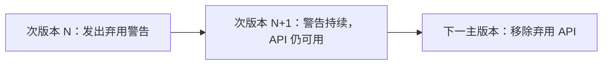

# 兼容性与版本策略

AxiomRL 致力于在持续演进的同时为用户提供可靠的稳定性保证。本文档说明项目的稳定性分层、版本规则和迁移指南。

## 三层稳定性模型

AxiomRL 将所有 API 划分为三个稳定性层级：

### :material-shield-check: 稳定层（Stable）

**范围：** `rl_training` 根包 + `rl_training.core`

- 受 [语义化版本](https://semver.org/lang/zh-CN/) 严格约束
- 破坏性变更**仅在主版本（major）发布**
- 任何移除或不兼容修改前，至少提前一个次版本发出弃用警告
- 适合生产环境使用

### :material-flask: 实验层（Experimental）

**范围：** `rl_training.experimental`

- API **可能在次版本（minor）发布中变更**
- 用于孵化新特性，在获得充分验证后可能提升至稳定层
- 适合愿意尝试新功能并接受 API 变动的用户

### :material-account-group: 社区 + Zoo 层（Contrib + Zoo）

**范围：** `rl_training.contrib` + `zoo/`

- **无稳定性保证**
- 社区贡献和基准预设可能随时变更
- 适合实验和参考用途

!!! abstract "稳定性层级速查"

    | 层级 | 命名空间 | 版本约束 | 适用场景 |
    |---|---|---|---|
    | 稳定 | `rl_training` / `rl_training.core` | 语义化版本 | 生产环境 |
    | 实验 | `rl_training.experimental` | 次版本可变 | 新特性试用 |
    | 社区 + Zoo | `rl_training.contrib` / `zoo/` | 无保证 | 实验、参考 |

## 语义化版本规则

AxiomRL 遵循 [语义化版本 2.0.0](https://semver.org/lang/zh-CN/) 规范，版本号格式为 `MAJOR.MINOR.PATCH`：

### 补丁版本（Patch） — `x.y.Z`

- 向后兼容的缺陷修复
- 不包含新功能或 API 变更
- 示例：`1.0.0` → `1.0.1`

### 次版本（Minor） — `x.Y.0`

- 向后兼容的新功能
- 可能包含对实验性 API 的变更
- 可能添加弃用警告
- 示例：`1.0.0` → `1.1.0`

### 主版本（Major） — `X.0.0`

- 可能包含破坏性变更
- 移除已弃用的 API
- 示例：`1.0.0` → `2.0.0`

## 弃用策略

AxiomRL 采用渐进式弃用流程，确保用户有充足的迁移时间：



### 弃用流程详解

1. **标记弃用**：在次版本发布时，对计划移除的 API 添加 `DeprecationWarning`
2. **保留期**：被弃用的 API 至少在**一个次版本周期**内保持可用
3. **移除**：在下一个主版本发布时移除弃用 API

### 弃用警告示例

```python
import warnings

def old_function():
    warnings.warn(
        "old_function 已弃用，请使用 new_function 替代。"
        "将在 2.0.0 版本中移除。",
        DeprecationWarning,
        stacklevel=2,
    )
    return new_function()
```

!!! tip "捕获弃用警告"

    建议在测试中启用弃用警告过滤，以便提前发现需要迁移的代码：

    ```bash
    python -W default::DeprecationWarning your_script.py
    ```

## 当前稳定核心

以下算法属于 `rl_training.core` 稳定命名空间，受语义化版本保护：

| 算法 | 类型 | 说明 |
|---|---|---|
| **A2C** | 在线策略 | Advantage Actor-Critic |
| **BC** | 离线学习 | Behavioral Cloning（行为克隆） |
| **CQL** | 离线学习 | Conservative Q-Learning |
| **DQN** | 离线策略 | Deep Q-Network |
| **DiscreteSAC** | 离线策略 | 离散动作空间的 Soft Actor-Critic |
| **IQL** | 离线学习 | Implicit Q-Learning |
| **PPO** | 在线策略 | Proximal Policy Optimization |
| **SAC** | 离线策略 | Soft Actor-Critic |
| **TD3** | 离线策略 | Twin Delayed DDPG |
| **TRPO** | 在线策略 | Trust Region Policy Optimization |

```python
# 推荐的导入方式
from rl_training.core import PPO, DQN, SAC
```

## 迁移指南

### 从根包导入迁移到分层导入

自 1.0.0 起，推荐使用分层命名空间导入，以明确所依赖的稳定性层级：

=== "旧方式（仍可用）"

    ```python
    from rl_training import PPO
    from rl_training import some_experimental_feature
    ```

=== "新方式（推荐）"

    ```python
    # 稳定 API — 受语义化版本保护
    from rl_training.core import PPO, SAC, DQN

    # 实验性 API — 可能在次版本中变更
    from rl_training.experimental import some_new_feature
    ```

!!! warning "注意"

    根包导入目前仍然可用，但建议逐步迁移到分层导入方式，以获得更清晰的稳定性预期。

### 迁移步骤

1. **审查当前导入**：检查代码中所有 `from rl_training import ...` 语句
2. **区分稳定与实验性 API**：对照上方的稳定核心列表
3. **更新导入路径**：
    - 稳定 API → `from rl_training.core import ...`
    - 实验性功能 → `from rl_training.experimental import ...`
4. **运行测试**：确保迁移后功能正常

## Python 版本支持

| Python 版本 | 支持状态 |
|---|---|
| 3.10 | :material-check-circle: 支持 |
| 3.11 | :material-check-circle: 支持 |
| 3.12 | :material-check-circle: 支持 |
| < 3.10 | :material-close-circle: 不支持 |

!!! note "最低 Python 版本"

    AxiomRL 要求 **Python >= 3.10**。这是因为项目使用了 `match` 语句、类型联合语法 `X | Y` 等 3.10+ 特性。

## PyTorch 兼容性

AxiomRL 基于 PyTorch 构建，支持当前活跃维护的 PyTorch 版本：

- 建议使用 PyTorch 最新稳定版以获得最佳兼容性
- GPU 训练需要与 PyTorch 版本匹配的 CUDA 工具包
- 具体版本要求请参阅 `pyproject.toml` 中的依赖声明

!!! tip "安装建议"

    建议先安装与你的 CUDA 版本匹配的 PyTorch，然后再安装 AxiomRL：

    ```bash
    # 示例：安装支持 CUDA 12.1 的 PyTorch
    pip install torch --index-url https://download.pytorch.org/whl/cu121

    # 然后安装 AxiomRL
    pip install axiomrl
    ```
