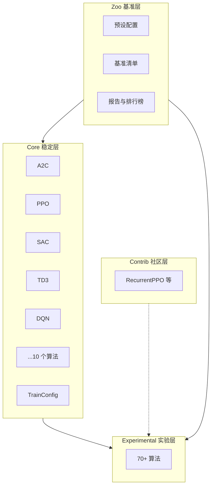

# 系统架构

AxiomRL 采用分层架构设计，在保证核心 API 稳定的同时，为实验性探索和社区贡献提供充足的空间。本页详细介绍各层的职责、稳定性保证及模块结构。

---

## 三层架构总览



上图展示了 AxiomRL 的四个主要层级及其依赖关系。Core 层是整个框架的基础，Experimental 层在其上扩展更多算法，Contrib 层以插件形式提供社区贡献，Zoo 层则同时依赖 Core 和 Experimental 来运行基准测试。

---

## Core 稳定层

!!! tip "稳定性保证"
    Core 层遵循 **语义化版本控制（SemVer）**。在同一主版本内，所有公开 API 保证向后兼容。升级次版本或补丁版本不会破坏您的现有代码。

Core 层包含 **10 个经过充分验证的强化学习算法**，是框架中最稳定、最可靠的部分。

**包含算法：**

| 算法 | 类型 | 说明 |
|------|------|------|
| A2C | On-Policy | Advantage Actor-Critic |
| BC | Offline | Behavioral Cloning（行为克隆） |
| CQL | Offline | Conservative Q-Learning |
| DQN | Off-Policy | Deep Q-Network |
| DiscreteSAC | Off-Policy | 离散动作空间 SAC |
| IQL | Offline | Implicit Q-Learning |
| PPO | On-Policy | Proximal Policy Optimization |
| SAC | Off-Policy | Soft Actor-Critic |
| TD3 | Off-Policy | Twin Delayed DDPG |
| TRPO | On-Policy | Trust Region Policy Optimization |

**导入方式：**

```python
from axiomrl.core import PPO, SAC, DQN, TrainConfig
```

Core 层同时包含 `TrainConfig` 数据类——整个训练流程的配置中枢。

---

## Experimental 实验层

!!! warning "API 可能变更"
    Experimental 层中的算法 API 可能在任意版本中发生变更。请在生产环境中谨慎使用，并在升级时关注变更日志。

Experimental 层提供 **70+ 实验性算法**，覆盖多智能体、模型预测控制、世界模型、元学习等前沿方向。这些算法经过基本验证，但尚未达到 Core 层的稳定性标准。

**导入方式：**

```python
from axiomrl.experimental import MAPPO, Dreamer, MAML
```

当实验性算法经过充分测试并满足稳定性标准后，将被提升至 Core 层。

---

## Contrib 社区层

Contrib 层承载**社区贡献的扩展算法和工具**，由各自的维护者独立管理。这些扩展通常以插件形式集成到框架中。

**典型扩展：**

- **RecurrentPPO** — 支持循环网络的 PPO 变体，适用于部分可观测环境

**导入方式：**

```python
from axiomrl.contrib import RecurrentPPO
```

!!! info "贡献指南"
    如果您开发了新的算法或工具，并希望将其纳入 Contrib 层，请参阅 [开发者文档](../developer/index.md) 了解贡献流程。

---

## Zoo 基准层

Zoo 层提供**基准预设、测试清单和性能报告**，用于算法的标准化评估和对比。

Zoo 层包含三个核心组件：

### 预设配置

预设配置（Presets）是预定义的 YAML 文件，包含针对特定环境和算法组合的最优超参数。使用预设可以快速复现基准结果。

### 基准清单

基准清单（Manifests）定义了一组需要运行的实验组合（算法 x 环境 x 种子），用于系统性地评估算法性能。

### 报告与排行榜

报告（Reports）自动聚合基准运行结果，生成性能对比图表和排行榜（Leaderboards），便于直观比较不同算法的表现。

---

## 模块结构

AxiomRL 的代码库由以下主要子包组成：

```
axiomrl/
├── core/              # Core 稳定层算法与核心组件
├── experimental/      # Experimental 实验性算法
├── contrib/           # Contrib 社区贡献
├── algorithms/        # 算法基类与通用接口
├── models/            # 神经网络模型（MLP、CNN、Transformer 等）
├── policies/          # 策略封装（确定性策略、随机策略等）
├── data/              # 数据结构（Buffer、Batch、Collector）
├── runtime/           # 运行时组件（执行后端、设备管理）
├── experiment/        # 实验管理（日志、检查点、评估）
└── zoo/               # 基准预设、清单与报告
```

| 子包 | 职责 |
|------|------|
| `algorithms/` | 定义算法基类 `BaseAlgorithm`，提供统一的训练、评估和保存接口 |
| `models/` | 提供可复用的神经网络模块，如 MLP、CNN 和 Transformer 编码器 |
| `policies/` | 封装策略逻辑，连接模型输出与动作选择 |
| `data/` | 实现经验缓存（ReplayBuffer）、数据采集（Collector）和批量数据结构 |
| `runtime/` | 管理执行后端（`execution_backend`）和设备分配（`device`） |
| `experiment/` | 统筹实验流程，包括 TensorBoard 日志、模型检查点和评估调度 |
