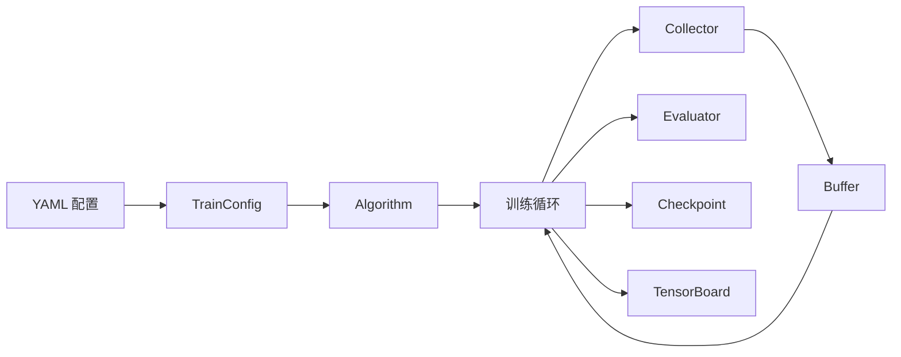

# 训练流程

本页详细介绍 AxiomRL 的完整训练管线——从 YAML 配置文件到训练产物（检查点、日志、评估结果）的全过程。

---

## 总览

AxiomRL 的训练流程遵循以下管线：



整个流程可概括为：**配置 → 初始化 → 循环（收集 → 缓存 → 更新 → 评估 → 记录）**。每个阶段的行为均由 `TrainConfig` 中的字段控制。

---

## 配置加载

训练从加载配置开始。AxiomRL 支持多种配置来源，最终统一解析为 `TrainConfig` 数据类。

### YAML 配置文件

最常见的方式是编写 YAML 文件：

```yaml
algo: PPO
env_id: CartPole-v1
seed: 42
total_timesteps: 100000
output_dir: ./runs/cartpole_ppo
num_envs: 4
eval_episodes: 10
```

### TrainConfig 数据类

所有配置最终转化为 `TrainConfig` 实例。以下是其完整字段：

| 字段 | 类型 | 默认值 | 说明 |
|------|------|--------|------|
| `algo` | `str` | *必填* | 算法名称（如 `"PPO"`、`"SAC"`） |
| `env_id` | `str` | *必填* | 环境 ID（如 `"CartPole-v1"`） |
| `seed` | `int` | *必填* | 随机种子，保证可复现性 |
| `total_timesteps` | `int` | *必填* | 总训练步数 |
| `output_dir` | `str` | *必填* | 输出目录路径 |
| `execution_backend` | `str` | `"local_sync"` | 执行后端 |
| `device` | `str` | `"auto"` | 计算设备（`"auto"`、`"cpu"`、`"cuda"`） |
| `num_envs` | `int` | `1` | 并行环境数量 |
| `eval_episodes` | `int` | `5` | 每次评估的回合数 |
| `log_interval` | `int` | `1` | 日志记录间隔（训练迭代数） |
| `checkpoint_interval` | `int` | `1` | 检查点保存间隔（训练迭代数） |
| `tags` | `tuple` | `()` | 实验标签，用于组织和筛选 |
| `benchmark` | `dict` | `{}` | 基准测试相关配置 |
| `algo_kwargs` | `dict` | `{}` | 传递给算法的额外参数 |
| `env_kwargs` | `dict` | `{}` | 传递给环境的额外参数 |

### 预设与 CLI 覆盖

配置的优先级从低到高为：

1. **Zoo 预设** — 预定义的最优超参数组合
2. **YAML 文件** — 用户自定义配置
3. **CLI 覆盖** — 命令行参数，优先级最高

```bash
# 使用预设并通过 CLI 覆盖部分参数
axiomrl train --config preset://cartpole_ppo --seed 123 --num_envs 8
```

---

## 算法初始化

配置加载完成后，框架根据 `algo` 字段从算法注册表中查找对应的算法类，并完成初始化。

### 注册表查找

AxiomRL 维护一个全局算法注册表。`algo` 字段的值（如 `"PPO"`）会被映射到对应的算法类（如 `axiomrl.core.PPO`）。查找顺序为：

1. Core 层
2. Experimental 层
3. Contrib 层

### 策略与网络创建

算法初始化时会自动完成以下步骤：

- 根据环境的观测空间和动作空间推断网络结构
- 创建策略网络（Policy Network）和价值网络（Value Network）
- 将网络部署到 `device` 指定的计算设备上
- 应用 `algo_kwargs` 中的自定义超参数

```python
# algo_kwargs 示例
algo_kwargs:
  learning_rate: 0.0003
  n_steps: 2048
  batch_size: 64
  gamma: 0.99
```

---

## 数据收集

Collector（数据采集器）负责与环境交互，收集训练所需的经验数据。

### Collector 工作机制

Collector 在每次采集步骤中执行以下操作：

1. 将当前观测输入策略网络，获取动作
2. 在环境中执行动作，获取下一观测、奖励和终止信号
3. 将转移元组 `(obs, action, reward, next_obs, done)` 存入 Buffer

### 向量化环境

通过 `num_envs` 参数可以启用多环境并行采集，显著提升数据吞吐量：

```yaml
num_envs: 8  # 同时运行 8 个环境实例
```

!!! tip "性能建议"
    对于 On-Policy 算法（如 PPO、A2C），增加 `num_envs` 可以线性提升采集速度。对于 Off-Policy 算法（如 SAC、TD3），通常 1-4 个环境即可满足需求。

---

## 经验缓存

Buffer（经验缓存）存储 Collector 采集的数据，供训练更新使用。AxiomRL 根据算法类型自动选择合适的缓存策略。

### Off-Policy：ReplayBuffer

Off-Policy 算法（DQN、SAC、TD3、CQL、IQL、DiscreteSAC）使用 **ReplayBuffer**：

- 固定容量的环形缓冲区
- 支持均匀随机采样
- 数据可被多次复用
- 支持优先级经验回放（PER）等变体

### On-Policy：Rollout Buffer

On-Policy 算法（PPO、A2C、TRPO）使用 **Rollout Buffer**：

- 存储完整的 rollout 数据
- 每次策略更新后清空
- 数据仅使用一次（或少量几个 epoch）
- 包含 GAE（Generalized Advantage Estimation）计算所需的额外信息

---

## 训练更新

训练循环的核心是策略和价值网络的梯度更新。

### 更新流程

每次训练迭代包含以下步骤：

1. 从 Buffer 中采样一个或多个批次的数据
2. 计算损失函数（策略损失、价值损失、熵正则化等）
3. 执行反向传播，更新网络参数
4. 记录训练指标（损失值、梯度范数等）

### 自定义超参数

通过 `algo_kwargs` 可以精细控制训练更新行为：

```yaml
algo_kwargs:
  learning_rate: 0.0003    # 学习率
  batch_size: 256          # 批量大小
  gamma: 0.99              # 折扣因子
  tau: 0.005               # 目标网络软更新系数
  gradient_steps: 1        # 每次采集后的梯度更新步数
```

---

## 评估

评估模块定期测试当前策略的性能，并跟踪最优模型。

### 评估机制

评估由 `eval_episodes` 字段控制：

```yaml
eval_episodes: 5  # 每次评估运行 5 个完整回合
```

每次评估会：

1. 使用确定性策略（无探索噪声）运行指定数量的回合
2. 记录平均回报、标准差、成功率等指标
3. 与历史最优结果对比

### 最优模型追踪

评估器自动追踪历史最优性能。当某次评估的平均回报超过历史最佳时，框架会将当前模型保存为 `best.pt`。

---

## 检查点

检查点系统负责定期保存训练状态，支持断点续训和模型部署。

### 保存策略

检查点的保存频率由 `checkpoint_interval` 控制：

```yaml
checkpoint_interval: 1  # 每次训练迭代都保存检查点
```

### 检查点文件

保存的检查点包含以下文件：

| 文件 | 说明 |
|------|------|
| `best.pt` | 评估性能最优的模型 |
| `step_N.pt` | 第 N 步的定期检查点 |

每个检查点包含完整的训练状态：网络权重、优化器状态、训练步数、随机数生成器状态等，确保断点续训的完全确定性。

!!! tip "断点续训"
    AxiomRL 的检查点机制保证了续训的确定性——从检查点恢复后继续训练，将得到与不中断训练完全一致的结果。

---

## 日志

AxiomRL 使用 TensorBoard 作为主要的日志后端，记录训练过程中的各项指标。

### 日志配置

日志记录频率由 `log_interval` 控制：

```yaml
log_interval: 1  # 每次训练迭代都记录日志
```

### 记录的指标

TensorBoard 日志包含以下典型指标：

- **训练指标** — 策略损失、价值损失、熵、学习率
- **采集指标** — 每回合奖励、回合长度、采集速度（FPS）
- **评估指标** — 平均评估回报、成功率
- **系统指标** — GPU 显存使用、训练耗时

### 查看日志

```bash
# 启动 TensorBoard 查看训练曲线
tensorboard --logdir ./runs
```

`output_dir` 字段指定了所有训练产物（检查点、日志、评估结果）的根目录。
