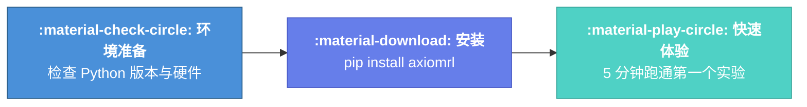

# 快速开始

欢迎使用 AxiomRL！本章节将引导你从环境准备到运行第一个实验，帮助你在最短时间内上手强化学习训练框架。

---

## 入门路线



---

## 章节导航

<div class="grid" markdown>

<div class="card" markdown>

### :material-clipboard-check: 环境要求

确认你的系统满足运行 AxiomRL 的最低要求，包括 Python 版本、操作系统和可选的 GPU 支持。

[:octicons-arrow-right-24: 查看环境要求](requirements.md)

</div>

<div class="card" markdown>

### :material-download: 安装指南

通过 pip、完整安装或开发模式安装 AxiomRL，并验证安装结果。

[:octicons-arrow-right-24: 安装指南](installation.md)

</div>

<div class="card" markdown>

### :material-timer-sand: 5 分钟上手

跟随三个渐进式示例，从离散动作到连续控制再到离线 RL，快速掌握基本用法。

[:octicons-arrow-right-24: 开始上手](quickstart.md)

</div>

</div>

---

## 准备好了吗？

!!! tip "建议"
    如果你是第一次使用 AxiomRL，建议按照 **环境要求 → 安装指南 → 5 分钟上手** 的顺序依次阅读。每个页面都包含完整的代码示例，可以直接复制运行。

!!! info "最短路径"
    已经熟悉 Python 环境配置？可以直接运行以下命令快速开始：

    ```bash
    pip install axiomrl
    axiomrl doctor          # 验证安装
    axiomrl train --config configs/ppo/cartpole.yaml
    ```
