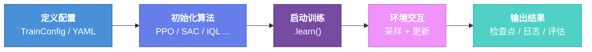

# 5 分钟上手

本教程通过三个渐进式示例，带你快速掌握 AxiomRL 的基本用法——从离散动作空间到连续控制，再到离线强化学习。

---

## 训练流程概览

每个 AxiomRL 训练任务都遵循以下流程：



---

## 示例 1：CartPole + PPO（离散动作）

经典的倒立摆平衡任务。动作空间为离散（向左或向右推），适合入门理解。

=== "Python API"

    ```python
    from rl_training.core import PPO, TrainConfig

    config = TrainConfig(
        algo="PPO",
        env_id="CartPole-v1",
        seed=42,
        total_timesteps=100_000,
        output_dir="runs/ppo_cartpole",
        num_envs=4,
        eval_episodes=10,
        log_interval=10,
        checkpoint_interval=50_000,
    )

    ppo = PPO(config)
    ppo.learn()
    ```

=== "CLI"

    ```bash
    axiomrl train --config configs/ppo/cartpole.yaml \
        --output-dir runs/ppo_cartpole \
        --total-timesteps 100000 \
        --seed 42
    ```

!!! example "预期输出"
    ```
    [PPO] 环境: CartPole-v1 | 设备: cuda | 并行环境数: 4
    ──────────────────────────────────────────────────
    步数         回报均值     回报标准差     策略损失     值函数损失
    10,000       156.3       42.1         -0.021       0.134
    20,000       312.7       68.5         -0.008       0.067
    50,000       478.2       21.3         -0.003       0.012
    100,000      500.0        0.0         -0.001       0.003
    ──────────────────────────────────────────────────
    训练完成！最终评估回报: 500.0 ± 0.0
    检查点已保存至: runs/ppo_cartpole/checkpoints/
    ```

!!! tip "关于 CartPole-v1"
    CartPole-v1 的最大回报为 500。如果训练结束时评估回报达到 500.0，说明智能体已经学会了完美的平衡策略。

---

## 示例 2：Pendulum + SAC（连续动作）

单摆控制任务。动作空间为连续（施加的扭矩），需要使用支持连续动作的算法。

=== "Python API"

    ```python
    from rl_training.core import SAC, TrainConfig

    config = TrainConfig(
        algo="SAC",
        env_id="Pendulum-v1",
        seed=42,
        total_timesteps=50_000,
        output_dir="runs/sac_pendulum",
        num_envs=1,
        eval_episodes=10,
        log_interval=10,
        checkpoint_interval=25_000,
        algo_kwargs={
            "learning_rate": 3e-4,
            "batch_size": 256,
            "tau": 0.005,
        },
    )

    sac = SAC(config)
    sac.learn()
    ```

=== "CLI"

    ```bash
    axiomrl train --config configs/sac/pendulum.yaml \
        --output-dir runs/sac_pendulum \
        --total-timesteps 50000 \
        --seed 42
    ```

!!! example "预期输出"
    ```
    [SAC] 环境: Pendulum-v1 | 设备: cuda | 并行环境数: 1
    ──────────────────────────────────────────────────
    步数         回报均值     回报标准差     Q值损失      策略损失     alpha
    5,000       -1182.4      312.5        2.451       -12.34      0.50
    10,000       -876.1      198.3        1.203        -8.72      0.32
    25,000       -312.6       87.2        0.342        -4.15      0.15
    50,000       -156.8       42.1        0.098        -2.03      0.08
    ──────────────────────────────────────────────────
    训练完成！最终评估回报: -156.8 ± 42.1
    检查点已保存至: runs/sac_pendulum/checkpoints/
    ```

!!! info "关于 Pendulum-v1"
    Pendulum-v1 的回报范围约为 [-1600, 0]。回报越接近 0 表示控制效果越好。SAC 算法在连续动作空间任务中表现优秀，是处理此类问题的推荐选择。

---

## 示例 3：离线 RL — Pendulum + IQL

离线强化学习使用预先收集的数据集进行训练，无需与环境实时交互。适用于无法在线采样的场景。

!!! warning "前置要求"
    离线 RL 需要安装可选依赖 `minari`：

    ```bash
    pip install axiomrl[offline]
    ```

=== "Python API"

    ```python
    from rl_training.core import IQL, TrainConfig

    config = TrainConfig(
        algo="IQL",
        env_id="Pendulum-v1",
        seed=42,
        total_timesteps=100_000,
        output_dir="runs/iql_pendulum",
        eval_episodes=10,
        log_interval=10,
        checkpoint_interval=50_000,
        algo_kwargs={
            "dataset": "pendulum-expert-v0",
            "expectile": 0.7,
            "temperature": 3.0,
            "learning_rate": 3e-4,
        },
    )

    iql = IQL(config)
    iql.learn()
    ```

=== "CLI"

    ```bash
    axiomrl train --config configs/iql/pendulum_offline.yaml \
        --output-dir runs/iql_pendulum \
        --total-timesteps 100000 \
        --seed 42
    ```

!!! example "预期输出"
    ```
    [IQL] 环境: Pendulum-v1 | 设备: cuda | 数据集: pendulum-expert-v0
    ──────────────────────────────────────────────────
    步数         评估回报     Q值损失      V值损失      策略损失
    10,000       -642.3      0.892       0.456       1.234
    25,000       -387.5      0.534       0.231       0.876
    50,000       -234.1      0.312       0.145       0.543
    100,000      -178.6      0.187       0.089       0.321
    ──────────────────────────────────────────────────
    训练完成！最终评估回报: -178.6 ± 56.3
    检查点已保存至: runs/iql_pendulum/checkpoints/
    ```

!!! tip "在线 vs 离线"
    - **在线 RL**（PPO、SAC）：训练过程中智能体与环境实时交互，不断采集新数据。
    - **离线 RL**（IQL、CQL）：使用预先收集的固定数据集训练，无需环境交互，适合真实世界中数据采集成本高昂的场景。

---

## 查看训练结果

训练完成后，可以使用 TensorBoard 查看训练曲线：

```bash
tensorboard --logdir runs/
```

在浏览器中打开 `http://localhost:6006` 即可看到实时训练指标。

输出目录结构如下：

```
runs/ppo_cartpole/
├── checkpoints/
│   ├── checkpoint_50000.pt
│   └── checkpoint_100000.pt
├── tensorboard/
│   └── events.out.tfevents.*
└── eval/
    └── eval_results.json
```

---

## 下一步

恭喜！你已经完成了 AxiomRL 的快速上手教程。接下来推荐继续探索：

<div class="grid" markdown>

<div class="card" markdown>

### :material-cube-outline: 核心概念

深入理解 TrainConfig、算法分层、执行后端等核心设计。

[:octicons-arrow-right-24: 核心概念](../concepts/index.md)

</div>

<div class="card" markdown>

### :material-brain: 算法参考

浏览全部 80+ 算法的详细文档与参数说明。

[:octicons-arrow-right-24: 算法参考](../algorithms/index.md)

</div>

<div class="card" markdown>

### :material-book-open-variant: 用户指南

学习超参数调优、自定义环境、分布式训练等进阶主题。

[:octicons-arrow-right-24: 用户指南](../guide/zoo-benchmarks.md)

</div>

<div class="card" markdown>

### :material-cog: 配置参考

了解 TrainConfig 的全部字段与 YAML 配置文件格式。

[:octicons-arrow-right-24: 配置参考](../configuration/index.md)

</div>

</div>
