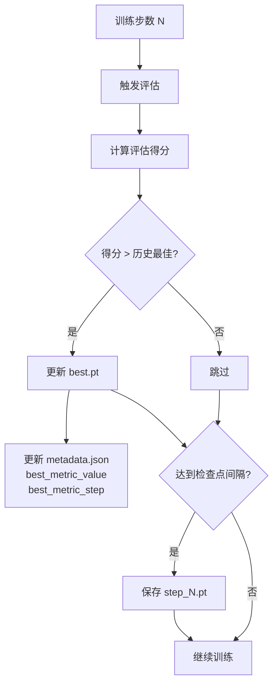
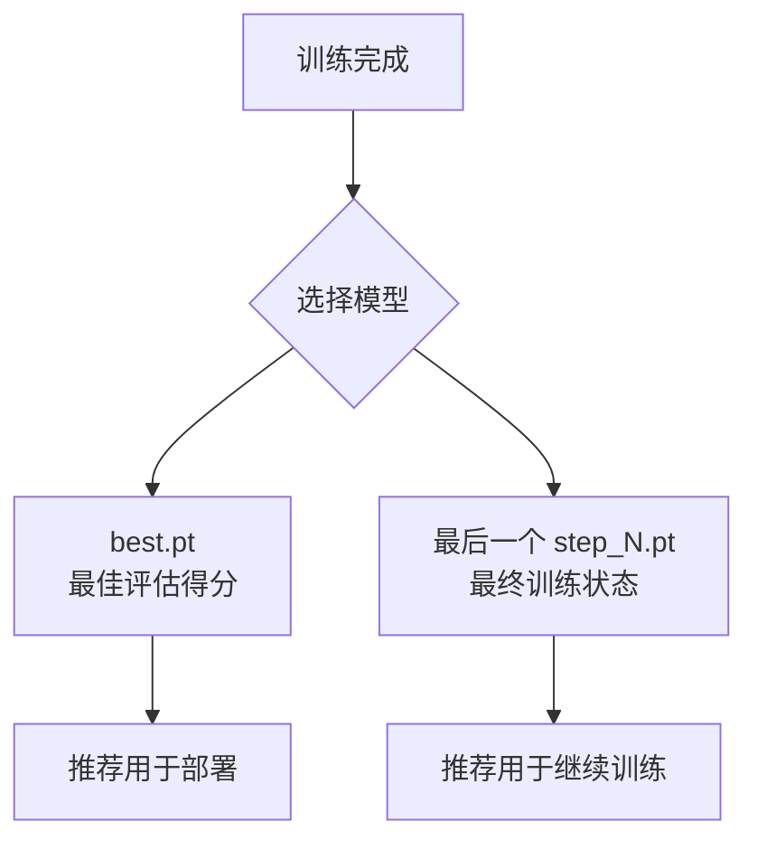

# 检查点与恢复

本章节详细介绍 AxiomRL 的运行目录结构、检查点管理机制、metadata 信息以及训练恢复流程。

## 运行目录结构

每次训练都会在 `output_dir` 下生成一个独立的运行目录，命名格式为：

```
<algo>__<env_id>__seed<seed>__<timestamp>
```

例如：

```
PPO__CartPole-v1__seed42__20260401_120000
```

### 目录内容

```
runs/
└── PPO__CartPole-v1__seed42__20260401_120000/
    ├── metadata.json       # 运行元数据
    ├── config.yaml         # 训练配置快照
    ├── checkpoints/        # 检查点目录
    │   ├── step_10000.pt   # 周期性检查点
    │   ├── step_20000.pt
    │   ├── step_30000.pt
    │   └── best.pt         # 最佳评估得分检查点
    └── tensorboard/        # TensorBoard 日志
        └── events.out.tfevents.*
```

!!! info "目录命名说明"

    - `<algo>`：算法名称（如 PPO、SAC）
    - `<env_id>`：环境 ID（如 CartPole-v1）
    - `<seed>`：随机种子值
    - `<timestamp>`：运行启动时间戳（`YYYYMMDD_HHMMSS` 格式）

## metadata.json 完整 Schema

每次运行都会生成 `metadata.json` 文件，记录实验的完整元信息。

| 字段 | 类型 | 说明 |
|------|------|------|
| `algo` | `string` | 使用的算法名称 |
| `env_id` | `string` | Gymnasium 环境 ID |
| `seed` | `integer` | 随机种子 |
| `total_timesteps` | `integer` | 目标总训练步数 |
| `output_dir` | `string` | 输出根目录路径 |
| `config_path` | `string` | 原始配置文件路径 |
| `python_version` | `string` | Python 版本（如 `3.11.5`） |
| `torch_version` | `string` | PyTorch 版本（如 `2.1.0`） |
| `gymnasium_version` | `string` | Gymnasium 版本（如 `0.29.1`） |
| `axiomrl_version` | `string` | AxiomRL 版本 |
| `platform` | `string` | 运行平台信息（如 `Linux-6.2.0-x86_64`） |
| `start_time` | `string` | 训练开始时间（ISO 8601 格式） |
| `last_checkpoint_step` | `integer` | 最后保存的检查点步数 |
| `best_metric_value` | `float` | 最佳评估指标值 |
| `best_metric_step` | `integer` | 达到最佳评估指标时的步数 |

??? example "metadata.json 示例"

    ```json
    {
        "algo": "PPO",
        "env_id": "CartPole-v1",
        "seed": 42,
        "total_timesteps": 1000000,
        "output_dir": "runs/",
        "config_path": "config.yaml",
        "python_version": "3.11.5",
        "torch_version": "2.1.0",
        "gymnasium_version": "0.29.1",
        "axiomrl_version": "0.1.0",
        "platform": "Linux-6.2.0-x86_64",
        "start_time": "2026-04-01T12:00:00",
        "last_checkpoint_step": 990000,
        "best_metric_value": 500.0,
        "best_metric_step": 850000
    }
    ```

## 检查点文件

AxiomRL 自动管理两种类型的检查点：

### 周期性检查点（step_N.pt）

按照 `checkpoint_interval` 设定的间隔定期保存：

```yaml
# 每 10000 步保存一次检查点
checkpoint_interval: 10000
```

生成的文件：

```
checkpoints/
├── step_10000.pt
├── step_20000.pt
├── step_30000.pt
└── ...
```

### 最佳检查点（best.pt）

每次评估后，如果当前评估得分超过历史最佳，则更新 `best.pt`：



!!! warning "磁盘空间注意"

    当 `checkpoint_interval` 设置较小且训练步数较多时，可能会产生大量检查点文件。建议根据实际需求合理设置检查点间隔：

    ```yaml
    # 每 50000 步保存一次，平衡粒度和存储空间
    checkpoint_interval: 50000
    ```

## 恢复训练

当训练中断（如硬件故障、手动停止等），可以从检查点恢复训练。

### CLI 恢复

使用 `axiomrl resume` 命令恢复训练：

```bash
# 基本恢复：从检查点继续训练
axiomrl resume --checkpoint runs/PPO__CartPole-v1__seed42__20260401_120000/checkpoints/step_500000.pt

# 指定新的总步数（继续训练到更多步数）
axiomrl resume \
    --checkpoint runs/PPO__CartPole-v1__seed42__20260401_120000/checkpoints/step_500000.pt \
    --total-timesteps 2000000

# 指定新的输出目录
axiomrl resume \
    --checkpoint runs/PPO__CartPole-v1__seed42__20260401_120000/checkpoints/step_500000.pt \
    --output-dir resumed_runs/

# 修改执行后端和评估回合数
axiomrl resume \
    --checkpoint runs/PPO__CartPole-v1__seed42__20260401_120000/checkpoints/step_500000.pt \
    --execution-backend local_sync \
    --eval-episodes 20
```

### Resume CLI 参数

| 参数 | 说明 |
|------|------|
| `--checkpoint` | **必填**。要恢复的检查点路径 |
| `--total-timesteps` | 新的总训练步数（覆盖原配置） |
| `--output-dir` | 新的输出目录（覆盖原配置） |
| `--execution-backend` | 新的执行后端（覆盖原配置） |
| `--eval-episodes` | 新的评估回合数（覆盖原配置） |

### Python API 恢复

```python title="resume_training.py" linenums="1"
from axiomrl import resume

# 基本恢复
resume(checkpoint="runs/PPO__CartPole-v1__seed42__20260401_120000/checkpoints/step_500000.pt")

# 带参数覆盖的恢复
resume(
    checkpoint="runs/PPO__CartPole-v1__seed42__20260401_120000/checkpoints/step_500000.pt",
    total_timesteps=2_000_000,
    output_dir="resumed_runs/",
    eval_episodes=20,
)
```

!!! tip "恢复的确定性"

    AxiomRL 的检查点保存了完整的训练状态，包括：

    - 模型参数（策略网络、价值网络等）
    - 优化器状态
    - 随机数生成器状态
    - 回放缓冲区（如适用）
    - 训练步数计数器

    这确保了恢复训练后的结果与不间断训练尽可能一致。

## 最佳模型选择策略



### 选择建议

| 场景 | 推荐检查点 | 原因 |
|------|------------|------|
| 模型部署/推理 | `best.pt` | 评估性能最优 |
| 继续训练 | 最新的 `step_N.pt` | 保留最新的训练状态 |
| 分析训练过程 | 多个 `step_N.pt` | 观察策略在不同训练阶段的表现 |
| 报告实验结果 | `best.pt` | 代表算法的最佳能力 |

!!! note "检查点与 metadata 的关系"

    `metadata.json` 中的 `best_metric_value` 和 `best_metric_step` 字段记录了 `best.pt` 对应的评估信息。`last_checkpoint_step` 记录了最后一个周期性检查点的步数。

    可以通过读取 metadata 来程序化选择最佳模型：

    ```python
    import json
    from pathlib import Path

    run_dir = Path("runs/PPO__CartPole-v1__seed42__20260401_120000")

    with open(run_dir / "metadata.json") as f:
        metadata = json.load(f)

    print(f"最佳得分: {metadata['best_metric_value']}")
    print(f"最佳步数: {metadata['best_metric_step']}")
    print(f"最后检查点: step_{metadata['last_checkpoint_step']}.pt")
    ```
