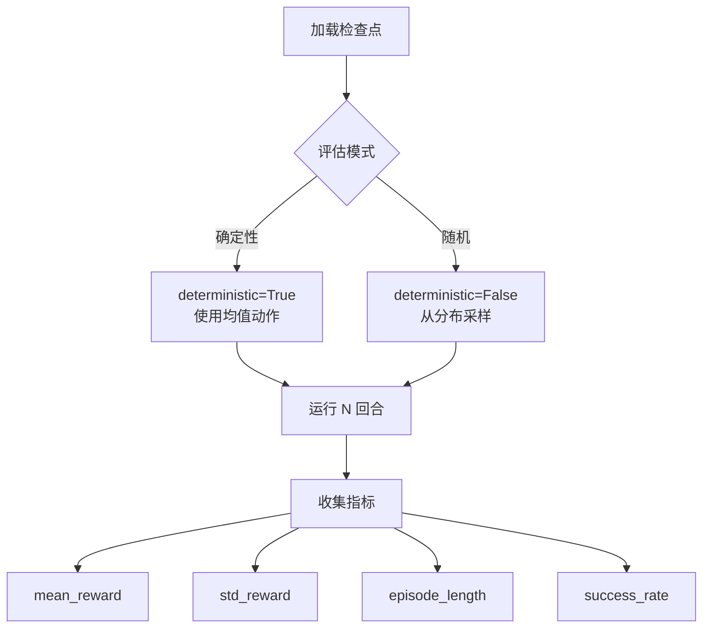

# 评估与推理

本章节介绍如何使用 AxiomRL 评估训练好的模型、加载检查点进行推理，以及录制评估视频。

## 模型评估

### CLI 评估

使用 `axiomrl eval` 命令快速评估已训练的模型：

```bash
# 基本评估：指定检查点路径和评估回合数
axiomrl eval --checkpoint runs/PPO__CartPole-v1__seed42__20260401_120000/checkpoints/best.pt \
    --num-episodes 100

# 评估特定步数的检查点
axiomrl eval --checkpoint runs/PPO__CartPole-v1__seed42__20260401_120000/checkpoints/step_500000.pt \
    --num-episodes 50
```

!!! tip "最佳模型 vs 特定步数"

    - `best.pt`：训练过程中评估得分最高的检查点，通常是最佳选择
    - `step_N.pt`：特定步数保存的检查点，适合分析训练过程中的策略变化

### Python API 评估

=== "基本评估"

    ```python title="evaluate.py" linenums="1"
    from axiomrl import evaluate

    # 指定检查点路径和评估回合数
    results = evaluate(
        checkpoint="runs/PPO__CartPole-v1__seed42__20260401_120000/checkpoints/best.pt",
        num_episodes=100,
    )

    # 查看评估结果
    print(f"平均回报: {results['mean_reward']:.2f}")
    print(f"标准差: {results['std_reward']:.2f}")
    print(f"最大回报: {results['max_reward']:.2f}")
    print(f"最小回报: {results['min_reward']:.2f}")
    ```

=== "自定义评估"

    ```python title="custom_evaluate.py" linenums="1"
    from axiomrl import load_checkpoint
    import gymnasium as gym

    # 加载检查点
    agent = load_checkpoint(
        "runs/PPO__CartPole-v1__seed42__20260401_120000/checkpoints/best.pt"
    )

    # 创建评估环境
    env = gym.make("CartPole-v1", render_mode="human")

    # 手动评估循环
    episode_rewards = []
    for episode in range(10):
        obs, info = env.reset()
        total_reward = 0
        done = False

        while not done:
            action = agent.predict(obs, deterministic=True)
            obs, reward, terminated, truncated, info = env.step(action)
            total_reward += reward
            done = terminated or truncated

        episode_rewards.append(total_reward)
        print(f"回合 {episode + 1}: 回报 = {total_reward:.2f}")

    env.close()
    print(f"\n平均回报: {sum(episode_rewards) / len(episode_rewards):.2f}")
    ```

## 加载检查点进行推理

AxiomRL 检查点包含恢复模型所需的全部信息，可以方便地加载并用于推理：

```python title="inference.py" linenums="1"
from axiomrl import load_checkpoint
import numpy as np

# 加载训练好的智能体
agent = load_checkpoint("runs/SAC__Hopper-v4__seed1__20260401_120000/checkpoints/best.pt")

# 单步推理
observation = np.random.randn(11)  # Hopper-v4 观测维度
action = agent.predict(observation, deterministic=True)
print(f"动作: {action}")
```

!!! note "确定性推理"

    设置 `deterministic=True` 使用策略的均值动作（对于随机策略），这在评估时通常能获得更好的性能。设置为 `False` 则从策略分布中采样动作。

## 视频录制

AxiomRL 支持在评估时自动录制环境的视频。

### 配置方法

通过 `env_kwargs` 配置视频录制：

```yaml title="config_with_video.yaml"
algo: PPO
env_id: CartPole-v1
seed: 42
total_timesteps: 500_000
output_dir: runs/

env_kwargs:
  capture_video: true
  video_folder: videos/
  video_episode_trigger: 50  # 每 50 回合录制一次视频
```

### 配置参数说明

| 参数 | 类型 | 说明 |
|------|------|------|
| `capture_video` | `bool` | 是否启用视频录制 |
| `video_folder` | `str` | 视频保存目录 |
| `video_episode_trigger` | `int` | 每隔多少回合录制一次 |

### Python API 视频录制

```python title="record_video.py" linenums="1"
from axiomrl import TrainConfig, train

config = TrainConfig(
    algo="PPO",
    env_id="CartPole-v1",
    seed=42,
    total_timesteps=500_000,
    env_kwargs={
        "capture_video": True,
        "video_folder": "videos/",
        "video_episode_trigger": 50,
    },
)

train(config)
```

!!! tip "视频格式"

    视频默认保存为 MP4 格式。确保系统安装了 `ffmpeg` 或 `moviepy` 以支持视频编码：

    ```bash
    # Ubuntu / Debian
    sudo apt-get install ffmpeg

    # macOS
    brew install ffmpeg

    # 或者通过 pip 安装 moviepy
    pip install moviepy
    ```

## 评估指标说明

AxiomRL 评估时会记录以下核心指标：

| 指标 | 说明 |
|------|------|
| `mean_reward` | 所有评估回合的平均累积奖励 |
| `std_reward` | 累积奖励的标准差 |
| `max_reward` | 最高单回合累积奖励 |
| `min_reward` | 最低单回合累积奖励 |
| `mean_episode_length` | 平均回合长度 |
| `success_rate` | 成功率（如果环境定义了成功条件） |



## 批量评估

对多个检查点或多个 seed 的模型进行批量评估：

```python title="batch_evaluate.py" linenums="1"
from pathlib import Path
from axiomrl import evaluate

runs_dir = Path("runs/")
results = {}

# 遍历所有运行目录
for run_dir in sorted(runs_dir.iterdir()):
    checkpoint = run_dir / "checkpoints" / "best.pt"
    if checkpoint.exists():
        result = evaluate(
            checkpoint=str(checkpoint),
            num_episodes=100,
        )
        results[run_dir.name] = result
        print(f"{run_dir.name}: {result['mean_reward']:.2f} +/- {result['std_reward']:.2f}")

# 汇总统计
mean_scores = [r["mean_reward"] for r in results.values()]
print(f"\n总体平均: {sum(mean_scores) / len(mean_scores):.2f}")
```

!!! info "配合报告系统"

    对于大规模实验评估，建议使用 AxiomRL 内置的报告系统（`axiomrl report`）和排行榜（`axiomrl leaderboard`），详见 [Zoo 基准测试](zoo-benchmarks.md) 章节。
