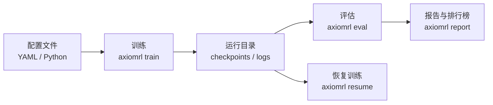

# 使用指南

欢迎阅读 AxiomRL 使用指南。本指南将引导你从基础训练到高级功能，全面掌握 AxiomRL 的使用方法。

!!! tip "快速导航"

    如果你刚接触 AxiomRL，建议按顺序阅读以下章节。如果你已有经验，可以直接跳转到感兴趣的主题。

-   :material-play-circle:{ .lg .middle } __训练详解__

    ---

    学习如何配置和启动训练任务，包括 YAML 配置、CLI 命令、Python API、多 seed 扫描和超参数调优。

    [:octicons-arrow-right-24: 开始训练](training.md)

-   :material-chart-line:{ .lg .middle } __评估与推理__

    ---

    了解如何评估训练好的模型，加载检查点进行推理，录制评估视频，以及理解各项评估指标。

    [:octicons-arrow-right-24: 模型评估](evaluation.md)

-   :material-content-save:{ .lg .middle } __检查点与恢复__

    ---

    掌握运行目录结构、检查点管理、metadata 信息、训练恢复以及最佳模型选择策略。

    [:octicons-arrow-right-24: 检查点管理](checkpointing.md)

-   :material-database:{ .lg .middle } __离线 RL 指南__

    ---

    从固定数据集中学习策略，支持 NPZ、PT、Minari 数据格式，覆盖 IQL、CQL、BC 等多种离线算法。

    [:octicons-arrow-right-24: 离线学习](offline-rl.md)

-   :material-image:{ .lg .middle } __像素观测__

    ---

    基于图像的强化学习，支持 DrQ、CURL、Dreamer 系列算法，配置帧堆叠、图像大小和像素包装器。

    [:octicons-arrow-right-24: 视觉 RL](pixel-observations.md)

-   :material-trophy:{ .lg .middle } __Zoo 基准测试__

    ---

    使用预设配置和基准清单运行标准化实验，生成报告和排行榜，进行算法对比分析。

    [:octicons-arrow-right-24: 基准测试](zoo-benchmarks.md)

## 核心概念速览

## 支持的核心算法

| 类别 | 算法 |
|------|------|
| 在线策略梯度 | PPO, TRPO, A2C |
| 离线策略 | DQN, SAC, TD3, DiscreteSAC |
| 离线 RL | IQL, CQL, BC |
| 视觉 RL | DrQ, CURL, DrQ-v2, Dreamer 系列 |
