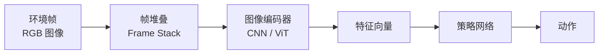

# 像素观测

本章节介绍如何使用 AxiomRL 进行基于图像的强化学习，包括算法选择、环境配置和最佳实践。

## 像素观测概述

传统的强化学习使用低维状态向量（如关节角度、速度等）作为观测，而基于像素的强化学习直接从原始图像帧中学习策略。这对于 Atari 游戏、真实世界机器人视觉控制等场景至关重要。



!!! info "像素观测 vs 状态观测"

    | 特性 | 状态观测 | 像素观测 |
    |------|----------|----------|
    | 输入维度 | 低维（几十维） | 高维（数万维） |
    | 计算成本 | 低 | 高 |
    | 通用性 | 需要特征工程 | 直接从原始数据学习 |
    | 训练时间 | 较短 | 较长 |
    | 适用场景 | 仿真环境 | Atari、视觉控制 |

## 支持的算法

AxiomRL 提供了多种专为像素观测设计的算法：

| 算法 | 说明 | 特点 |
|------|------|------|
| **DrQ** | Data-regularized Q | 通过数据增强提升样本效率 |
| **CURL** | Contrastive Unsupervised RL | 对比学习预训练图像编码器 |
| **DrQ-v2** | DrQ 改进版 | 更强的数据增强和训练稳定性 |
| **Dreamer** | 世界模型方法 | 在学习的潜在空间中规划 |
| **DreamerV3** | Dreamer 第三代 | 无需超参数调优的通用世界模型 |

## 配置方法

像素观测的配置主要涉及 `algo_kwargs` 和 `env_kwargs` 两部分。

### 核心参数

#### algo_kwargs 中的像素相关参数

| 参数 | 类型 | 说明 | 常用值 |
|------|------|------|--------|
| `frame_stack` | `int` | 帧堆叠数量 | 3 或 4 |
| `image_size` | `int` | 输入图像尺寸（正方形） | 84 |
| `encoder_type` | `str` | 编码器类型 | `"cnn"`, `"vit"` |
| `encoder_feature_dim` | `int` | 编码器输出特征维度 | 50 |
| `encoder_num_layers` | `int` | 编码器层数 | 4 |
| `encoder_num_filters` | `int` | 卷积核数量 | 32 |

#### env_kwargs 中的像素包装器参数

| 参数 | 类型 | 说明 |
|------|------|------|
| `render_mode` | `str` | 渲染模式，像素观测需设为 `"rgb_array"` |
| `pixel_wrapper` | `bool` | 是否启用像素包装器 |
| `frame_skip` | `int` | 帧跳过数量 |
| `grayscale` | `bool` | 是否转换为灰度图像 |

## Atari 环境配置

Atari 环境是像素观测 RL 最经典的基准环境。

### 安装 Atari 依赖

```bash
# 安装 ale-py（Atari Learning Environment）
pip install "axiomrl[atari]"

# 或手动安装
pip install ale-py gymnasium[atari]

# 导入 ROM（需要接受许可协议）
ale-import-roms /path/to/roms/
```

!!! warning "ROM 许可"

    Atari ROM 文件受版权保护。你可以通过 `AutoROM` 工具自动获取免费的 ROM：

    ```bash
    pip install autorom
    AutoROM --accept-license
    ```

### Atari 配置示例

```yaml title="atari_drq.yaml" linenums="1"
algo: DrQ
env_id: ALE/Breakout-v5
seed: 42
total_timesteps: 10_000_000
output_dir: runs/
device: cuda
num_envs: 1
eval_episodes: 10
checkpoint_interval: 100

algo_kwargs:
  frame_stack: 4
  image_size: 84
  learning_rate: 1.0e-4
  batch_size: 32
  gamma: 0.99
  tau: 0.01
  buffer_size: 1_000_000
  learning_starts: 20000
  train_freq: 2
  gradient_steps: 1
  encoder_type: cnn
  encoder_feature_dim: 50
  encoder_num_layers: 4
  encoder_num_filters: 32

env_kwargs:
  render_mode: rgb_array
  frameskip: 4
  repeat_action_probability: 0.0
```

## YAML 配置示例

### DrQ-v2 + DMControl

```yaml title="drqv2_cheetah.yaml" linenums="1"
algo: DrQ-v2
env_id: dm_control/cheetah-run
seed: 42
total_timesteps: 1_000_000
output_dir: runs/
device: cuda
num_envs: 1

algo_kwargs:
  frame_stack: 3
  image_size: 84
  learning_rate: 1.0e-4
  batch_size: 256
  gamma: 0.99
  tau: 0.01
  buffer_size: 1_000_000
  learning_starts: 4000
  encoder_type: cnn
  encoder_feature_dim: 50
  augmentation: random_shift  # DrQ-v2 数据增强

env_kwargs:
  render_mode: rgb_array
  pixel_wrapper: true
```

### DreamerV3 + Atari

```yaml title="dreamerv3_atari.yaml" linenums="1"
algo: DreamerV3
env_id: ALE/Pong-v5
seed: 42
total_timesteps: 5_000_000
output_dir: runs/
device: cuda

algo_kwargs:
  frame_stack: 1         # Dreamer 通常不需要帧堆叠
  image_size: 64
  learning_rate: 1.0e-4
  batch_size: 16
  gamma: 0.997
  imagination_horizon: 15
  model_lr: 1.0e-4
  actor_lr: 3.0e-5
  critic_lr: 3.0e-5

env_kwargs:
  render_mode: rgb_array
  frameskip: 4
```

### CURL + MuJoCo 像素

```yaml title="curl_walker.yaml" linenums="1"
algo: CURL
env_id: dm_control/walker-walk
seed: 42
total_timesteps: 500_000
output_dir: runs/
device: cuda

algo_kwargs:
  frame_stack: 3
  image_size: 84
  learning_rate: 1.0e-3
  batch_size: 128
  gamma: 0.99
  tau: 0.01
  encoder_type: cnn
  encoder_feature_dim: 50
  curl_latent_dim: 128   # CURL 对比学习潜在空间维度

env_kwargs:
  render_mode: rgb_array
  pixel_wrapper: true
```

## Python API 示例

=== "DrQ 训练"

    ```python title="drq_train.py" linenums="1"
    from axiomrl import TrainConfig, train

    config = TrainConfig(
        algo="DrQ",
        env_id="ALE/Breakout-v5",
        seed=42,
        total_timesteps=10_000_000,
        output_dir="runs/",
        device="cuda",
        algo_kwargs={
            "frame_stack": 4,
            "image_size": 84,
            "learning_rate": 1e-4,
            "batch_size": 32,
            "gamma": 0.99,
            "tau": 0.01,
            "buffer_size": 1_000_000,
            "learning_starts": 20000,
            "encoder_type": "cnn",
            "encoder_feature_dim": 50,
        },
        env_kwargs={
            "render_mode": "rgb_array",
            "frameskip": 4,
        },
    )

    train(config)
    ```

=== "DreamerV3 训练"

    ```python title="dreamer_train.py" linenums="1"
    from axiomrl import TrainConfig, train

    config = TrainConfig(
        algo="DreamerV3",
        env_id="ALE/Pong-v5",
        seed=42,
        total_timesteps=5_000_000,
        output_dir="runs/",
        device="cuda",
        algo_kwargs={
            "frame_stack": 1,
            "image_size": 64,
            "learning_rate": 1e-4,
            "batch_size": 16,
            "gamma": 0.997,
            "imagination_horizon": 15,
        },
        env_kwargs={
            "render_mode": "rgb_array",
            "frameskip": 4,
        },
    )

    train(config)
    ```

## 常见问题与最佳实践

!!! question "GPU 内存不足怎么办？"

    像素观测训练对 GPU 内存需求较大。以下方法可以减少内存占用：

    1. 减小 `batch_size`（如从 256 降到 64 或 32）
    2. 减小 `image_size`（如从 84 降到 64）
    3. 减小 `buffer_size`（回放缓冲区是主要的内存消耗源）
    4. 使用混合精度训练（如果算法支持）

!!! question "训练速度太慢？"

    1. 确保使用 GPU 训练（`device: cuda`）
    2. 增加 `frame_skip` 以减少每步的计算量
    3. 调整 `train_freq` 和 `gradient_steps` 的比例
    4. 对于 Atari 环境，使用标准的预处理包装器

!!! question "如何选择帧堆叠数？"

    | 环境类型 | 推荐 `frame_stack` | 原因 |
    |----------|-------------------|------|
    | Atari | 4 | 标准设置，捕捉运动信息 |
    | DMControl | 3 | 足以推断速度 |
    | Dreamer 系列 | 1 | 世界模型自行处理时序信息 |

!!! tip "性能优化建议"

    - **数据增强**：DrQ 和 DrQ-v2 通过随机裁剪/平移数据增强显著提升样本效率
    - **编码器共享**：在 Actor-Critic 架构中共享编码器可以加速训练
    - **灰度转换**：对于 Atari 环境，灰度图像通常足够且更高效
    - **图像归一化**：确保像素值归一化到 [0, 1] 范围
    - **预训练编码器**：对于复杂视觉场景，可以考虑使用预训练的视觉编码器
