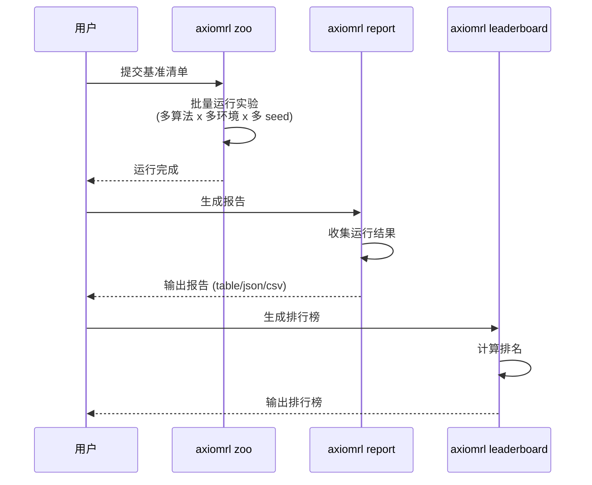

# Zoo 基准测试

本章节介绍 AxiomRL Zoo 系统，包括预设配置管理、基准测试运行、报告生成和排行榜功能。

## Zoo 概述

AxiomRL Zoo 提供了一套完整的基准测试工作流：


- **预设配置（Preset）**：为特定算法和环境预先调优的 YAML 配置文件
- **基准清单（Manifest）**：定义一组实验的批量运行计划
- **报告系统（Report）**：自动收集运行结果并生成对比报告
- **排行榜（Leaderboard）**：对不同算法和环境的性能进行排名

## 预设配置

### 目录结构

Zoo 的预设配置按环境类型组织：

```
zoo/
├── atari/
│   ├── dqn_breakout.yaml
│   ├── drq_pong.yaml
│   ├── ppo_spaceinvaders.yaml
│   └── benchmark.yaml          # Atari 基准清单
├── mujoco/
│   ├── ppo_halfcheetah.yaml
│   ├── sac_hopper.yaml
│   ├── td3_walker2d.yaml
│   └── benchmark.yaml          # MuJoCo 基准清单
├── dm_control/
│   ├── drqv2_cheetah_run.yaml
│   ├── sac_cartpole_swingup.yaml
│   └── benchmark.yaml
└── offline/
    ├── iql_hopper_medium.yaml
    ├── cql_halfcheetah_medium.yaml
    └── benchmark.yaml
```

### 预设 YAML 示例

```yaml title="zoo/mujoco/ppo_halfcheetah.yaml" linenums="1"
algo: PPO
env_id: HalfCheetah-v4
seed: 1
total_timesteps: 1_000_000
output_dir: runs/zoo/mujoco/
num_envs: 8
eval_episodes: 10
checkpoint_interval: 50

tags:
  - zoo
  - mujoco
  - ppo

algo_kwargs:
  learning_rate: 3.0e-4
  n_steps: 2048
  batch_size: 64
  n_epochs: 10
  gamma: 0.99
  gae_lambda: 0.95
  clip_range: 0.2
  ent_coef: 0.0
  vf_coef: 0.5
  max_grad_norm: 0.5
```

!!! tip "预设配置的优势"

    预设配置文件中的超参数已经过调优，可以作为基准线直接使用，也可以在此基础上进行进一步调整。

## 基准清单

基准清单（Manifest）定义了一组实验的批量运行计划，包括算法、环境、种子等信息。

### 清单 YAML 格式

```yaml title="zoo/mujoco/benchmark.yaml" linenums="1"
name: MuJoCo Benchmark
description: 标准 MuJoCo 连续控制基准测试

# 运行配置
output_dir: runs/zoo/mujoco/
seeds:
  - 1
  - 2
  - 3
  - 4
  - 5

# 实验矩阵
experiments:
  - config: zoo/mujoco/ppo_halfcheetah.yaml
  - config: zoo/mujoco/sac_hopper.yaml
  - config: zoo/mujoco/td3_walker2d.yaml
  - config: zoo/mujoco/ppo_hopper.yaml
  - config: zoo/mujoco/sac_halfcheetah.yaml
  - config: zoo/mujoco/td3_halfcheetah.yaml
```

### 运行基准

使用 `axiomrl zoo` 命令运行基准测试：

```bash
# 运行完整基准
axiomrl zoo --manifest zoo/mujoco/benchmark.yaml

# 运行 Atari 基准
axiomrl zoo --manifest zoo/atari/benchmark.yaml

# 运行离线 RL 基准
axiomrl zoo --manifest zoo/offline/benchmark.yaml
```

!!! note "运行时间"

    基准测试通常包含大量实验（多算法 x 多环境 x 多种子），运行时间可能很长。建议在配备 GPU 的服务器上运行。

## 报告生成

训练完成后，使用 `axiomrl report` 生成实验报告。

### 基本用法

```bash
# 生成文本格式报告
axiomrl report --runs-dir runs/zoo/mujoco/ --format table

# 生成 JSON 格式报告
axiomrl report --runs-dir runs/zoo/mujoco/ --format json

# 生成 CSV 格式报告
axiomrl report --runs-dir runs/zoo/mujoco/ --format csv
```

### 过滤选项

```bash
# 按算法过滤
axiomrl report --runs-dir runs/ --algo PPO

# 按环境过滤
axiomrl report --runs-dir runs/ --env-id HalfCheetah-v4

# 按算法分组
axiomrl report --runs-dir runs/ --group-by algo

# 要求最少种子数
axiomrl report --runs-dir runs/ --min-seeds 3

# 只显示每个环境的 Top-K 算法
axiomrl report --runs-dir runs/ --top-k 3
```

### 报告输出格式

| 格式 | 参数 | 说明 |
|------|------|------|
| `table` | `--format table` | 终端表格展示（默认） |
| `json` | `--format json` | JSON 格式，便于程序处理 |
| `csv` | `--format csv` | CSV 格式，便于导入表格软件 |

??? example "文本报告示例"

    ```
    ╔══════════════════════════════════════════════════════════════╗
    ║                    MuJoCo Benchmark Report                  ║
    ╠══════════╦════════════════════╦═══════════╦═════════════════╣
    ║ 算法     ║ 环境               ║ Seeds     ║ 平均回报 ± 标准差 ║
    ╠══════════╬════════════════════╬═══════════╬═════════════════╣
    ║ PPO      ║ HalfCheetah-v4     ║ 5         ║ 6543.2 ± 321.4  ║
    ║ PPO      ║ Hopper-v4          ║ 5         ║ 2876.1 ± 156.3  ║
    ║ SAC      ║ HalfCheetah-v4     ║ 5         ║ 11234.5 ± 543.2 ║
    ║ SAC      ║ Hopper-v4          ║ 5         ║ 3421.8 ± 234.1  ║
    ║ TD3      ║ HalfCheetah-v4     ║ 5         ║ 10876.3 ± 487.6 ║
    ║ TD3      ║ Walker2d-v4        ║ 5         ║ 4532.1 ± 312.5  ║
    ╚══════════╩════════════════════╩═══════════╩═════════════════╝
    ```

## 排行榜

使用 `axiomrl leaderboard` 生成算法排行榜。

### 基本用法

```bash
# 基本排行榜
axiomrl leaderboard --runs-dir runs/zoo/mujoco/

# 指定排名指标
axiomrl leaderboard --runs-dir runs/zoo/mujoco/ --leaderboard-metric mean_reward

# 与基准线对比
axiomrl leaderboard --runs-dir runs/zoo/mujoco/ --compare-to PPO
```

### 排行榜选项

| 参数 | 说明 | 示例 |
|------|------|------|
| `--runs-dir` | 运行目录路径 | `runs/zoo/mujoco/` |
| `--leaderboard-metric` | 排名使用的指标 | `mean_reward` |
| `--compare-to` | 对比的基准算法 | `PPO` |
| `--score-view` | 分数展示方式 | `absolute`, `relative` |
| `--sort-by` | 排序依据 | `mean_reward`, `max_reward` |
| `--descending` | 是否降序排列 | 标志位（flag） |
| `--algo` | 过滤指定算法 | `SAC` |
| `--env-id` | 过滤指定环境 | `HalfCheetah-v4` |
| `--group-by` | 分组依据 | `algo`, `env_id` |
| `--min-seeds` | 最少种子数要求 | `3` |
| `--top-k` | 每组显示前 K 名 | `5` |

### 排行榜示例

```bash
# 完整排行榜：按平均奖励降序排列
axiomrl leaderboard \
    --runs-dir runs/zoo/mujoco/ \
    --leaderboard-metric mean_reward \
    --sort-by mean_reward \
    --descending

# 相对分数视图：以 PPO 为基准
axiomrl leaderboard \
    --runs-dir runs/zoo/mujoco/ \
    --compare-to PPO \
    --score-view relative

# 过滤并排名：只看 HalfCheetah 环境的 Top 3
axiomrl leaderboard \
    --runs-dir runs/zoo/mujoco/ \
    --env-id HalfCheetah-v4 \
    --top-k 3 \
    --min-seeds 3 \
    --descending
```

## 完整工作流

以下是一个完整的基准测试工作流示例：

### 第一步：准备基准清单

```yaml title="my_benchmark.yaml" linenums="1"
name: My Custom Benchmark
description: 自定义 MuJoCo 基准测试

output_dir: runs/my_benchmark/
seeds:
  - 1
  - 2
  - 3

experiments:
  - config: zoo/mujoco/ppo_halfcheetah.yaml
  - config: zoo/mujoco/sac_halfcheetah.yaml
  - config: zoo/mujoco/td3_halfcheetah.yaml
```

### 第二步：运行基准测试

```bash
axiomrl zoo --manifest my_benchmark.yaml
```

### 第三步：生成报告

```bash
# 文本报告
axiomrl report --runs-dir runs/my_benchmark/ --format table

# JSON 报告（便于后续分析）
axiomrl report --runs-dir runs/my_benchmark/ --format json > report.json
```

### 第四步：查看排行榜

```bash
axiomrl leaderboard \
    --runs-dir runs/my_benchmark/ \
    --leaderboard-metric mean_reward \
    --sort-by mean_reward \
    --descending \
    --min-seeds 3
```



!!! tip "可复现的基准测试"

    为确保实验的可复现性，建议：

    1. **版本锁定**：在基准清单中记录 AxiomRL 版本
    2. **多 seed 运行**：至少使用 3-5 个不同的种子
    3. **保存完整配置**：每次运行会自动保存 `config.yaml` 快照
    4. **使用 metadata**：`metadata.json` 记录了完整的软件版本和硬件信息
    5. **版本控制**：将 Zoo 预设配置和基准清单纳入 Git 管理
