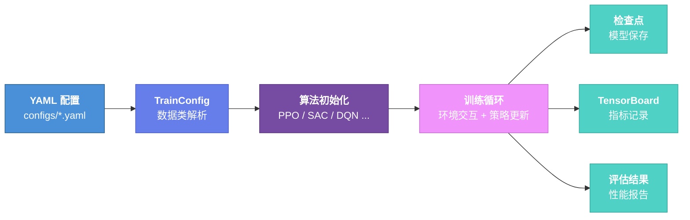

---
hide:
  - navigation
  - toc
---

<div class="axiomrl-hero" markdown>

# AxiomRL

### 80+ 算法的 PyTorch 强化学习库

[]()
[]()
[]()
[]()

一个统一、高效、可扩展的强化学习训练框架，涵盖在线学习、离线学习、模仿学习等多种范式。

[快速开始 :material-arrow-right:](getting-started/index.md){ .md-button .md-button--primary }
[查看算法 :material-brain:](algorithms/index.md){ .md-button }

</div>

---

<div class="grid" markdown>

<div class="card" markdown>

:material-rocket-launch:{ .lg .middle } **快速开始**

---

从零开始搭建环境、安装依赖，五分钟内运行第一个强化学习实验。

[:octicons-arrow-right-24: 开始](getting-started/index.md)

</div>

<div class="card" markdown>

:material-cube-outline:{ .lg .middle } **核心概念**

---

深入理解 TrainConfig、算法层级、执行后端等框架核心设计思想。

[:octicons-arrow-right-24: 了解更多](concepts/index.md)

</div>

<div class="card" markdown>

:material-brain:{ .lg .middle } **算法参考**

---

浏览全部 80+ 强化学习算法，涵盖 6 大类别，附带完整参数说明。

[:octicons-arrow-right-24: 查看算法](algorithms/index.md)

</div>

<div class="card" markdown>

:material-cog:{ .lg .middle } **配置参考**

---

详细了解 YAML 配置文件格式、TrainConfig 字段定义与高级选项。

[:octicons-arrow-right-24: 配置详情](configuration/index.md)

</div>

<div class="card" markdown>

:material-console:{ .lg .middle } **CLI 工具**

---

使用 `axiomrl` 命令行工具进行训练、评估、超参搜索等操作。

[:octicons-arrow-right-24: CLI 文档](cli/index.md)

</div>

<div class="card" markdown>

:material-chart-bar:{ .lg .middle } **Zoo 基准**

---

利用 `axiomrl-zoo` 运行标准化基准测试，复现论文结果。

[:octicons-arrow-right-24: 基准测试](guide/zoo-benchmarks.md)

</div>

</div>

---

## 快速体验

只需几行代码即可启动一个完整的强化学习训练流程：

=== "Python API"

    ```python
    from axiomrl.core import PPO, TrainConfig

    config = TrainConfig(
        algo="PPO",
        env_id="CartPole-v1",
        seed=42,
        total_timesteps=100_000,
        output_dir="runs/ppo_cartpole",
    )
    ppo = PPO(config)
    ppo.learn()
    ```

=== "CLI"

    ```bash
    axiomrl train --config configs/ppo/cartpole.yaml \
        --output-dir runs/ppo_cartpole \
        --total-timesteps 100000
    ```

---

## 核心特性

| 特性 | 说明 |
|------|------|
| :material-brain: **80+ 算法** | 涵盖在线、离线、模仿学习等 6 大类别 |
| :material-layers-triple: **三层 API** | `core`（10 个稳定算法）、`experimental`（全部算法）、`contrib`（社区贡献） |
| :material-file-cog: **声明式配置** | 通过 YAML 文件或 `TrainConfig` 数据类定义完整的实验参数 |
| :material-console: **CLI 工具** | `axiomrl` 命令行一键启动训练、评估、基准测试 |
| :material-chart-timeline-variant: **TensorBoard 集成** | 自动记录训练指标，实时监控实验进展 |
| :material-refresh: **确定性检查点** | 支持从检查点精确恢复训练，保证结果可复现 |
| :material-gpu: **多设备支持** | 无缝切换 CPU / CUDA 训练，支持多环境并行 |
| :material-package-variant: **PyPI 发布** | `pip install axiomrl` 即可安装，MIT 开源协议 |

---

## 技术架构



---

## 稳定核心算法

`axiomrl.core` 提供经过充分验证的 10 个核心算法：

| 算法 | 类型 | 动作空间 | 说明 |
|------|------|----------|------|
| **A2C** | 在线策略 | 离散 / 连续 | Advantage Actor-Critic |
| **PPO** | 在线策略 | 离散 / 连续 | Proximal Policy Optimization |
| **TRPO** | 在线策略 | 离散 / 连续 | Trust Region Policy Optimization |
| **DQN** | 离线策略 | 离散 | Deep Q-Network |
| **SAC** | 离线策略 | 连续 | Soft Actor-Critic |
| **DiscreteSAC** | 离线策略 | 离散 | Discrete Soft Actor-Critic |
| **TD3** | 离线策略 | 连续 | Twin Delayed DDPG |
| **BC** | 模仿学习 | 离散 / 连续 | Behavioral Cloning |
| **CQL** | 离线 RL | 离散 / 连续 | Conservative Q-Learning |
| **IQL** | 离线 RL | 离散 / 连续 | Implicit Q-Learning |
